# Formal Market Mechanisms

TLA+ specifications for comparing market mechanisms. The goal is to formally verify correctness properties and compare structural differences across centralized, decentralized, continuous, and batched trading systems.

## Mechanisms

### CentralizedCLOB

A continuous limit order book with a single matching engine. Orders are matched immediately using price-time priority. This models traditional exchanges like NYSE, NASDAQ, and centralized crypto exchanges (Binance, Coinbase).

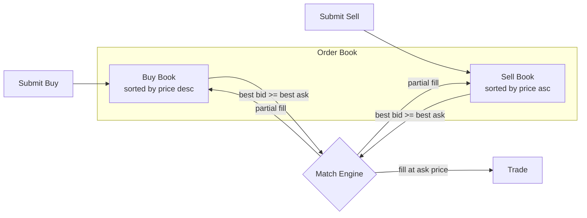

Each order is matched **immediately** on arrival. The trade executes at the resting order's price. Different trades can execute at different prices (enabling spread arbitrage).

- **Matching**: best bid vs best ask, executes at the ask (resting order) price
- **Partial fills**: smaller side is fully filled, larger side's quantity is reduced
- **Self-trade prevention**: a trader cannot match against themselves

**Verified properties:**
| Property | Type | Description |
|---|---|---|
| PositiveBookQuantities | Invariant | Every resting order has quantity > 0 |
| PositiveTradeQuantities | Invariant | Every trade has quantity > 0 |
| PriceImprovement | Invariant | Trade price <= buyer's limit and >= seller's limit |
| NoSelfTrades | Invariant | No trade has the same buyer and seller |
| UniqueOrderIds | Invariant | All order IDs on the books are distinct |
| ConservationOfAssets | Invariant | Trade log is consistent across traders |
| EventualMatching | Liveness | Crossed books between different traders are eventually resolved |

### BatchedAuction

A periodic auction that collects orders over a batch window, then clears all at a single uniform price that maximizes traded volume. This models systems like [Penumbra](https://penumbra.zone/) (sealed-bid batch auctions with privacy on Cosmos), [CoW Protocol](https://cow.fi/) (batch auctions for MEV protection), and NYSE/NASDAQ opening/closing auctions. The academic foundation is Budish, Cramton, and Shim's "[The High-Frequency Trading Arms Race](https://faculty.chicagobooth.edu/eric.budish/research/HFT-FrequentBatchAuctions.pdf)" (2015), which proposes frequent batch auctions to eliminate the latency arms race.

Because `OrderingIndependence` is verified, batch auctions are safe to decentralize — validators only need to agree on the **set** of orders, not their **sequence**. This is why Penumbra and CoW Protocol can run batch auctions across distributed validators without the consensus problems that plague decentralized CLOBs.

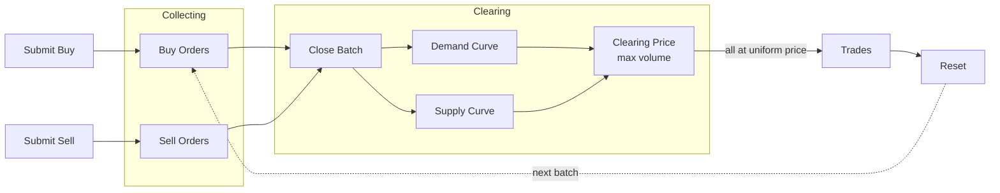

Orders accumulate during the **collection phase** without matching. When the batch closes, a single **clearing price** is computed that maximizes traded volume. All trades execute at this uniform price — no spread to capture.

- **Collection phase**: orders accumulate without matching
- **Clearing phase**: compute clearing price from aggregate supply/demand curves, fill eligible orders at the uniform price
- **Self-trade prevention**: buyer-seller pairs with the same trader are skipped during clearing

**Verified properties:**
| Property | Type | Description |
|---|---|---|
| UniformClearingPrice | Invariant | All trades in a batch execute at the same price |
| PriceImprovement | Invariant | Trade price <= buyer's limit and >= seller's limit |
| PositiveTradeQuantities | Invariant | Every trade has quantity > 0 |
| NoSelfTrades | Invariant | No trade has the same buyer and seller |
| OrderingIndependence | Invariant | Clearing result matches the deterministic clearing price regardless of submission order |
| NoSpreadArbitrage | Invariant | No price difference to exploit within a batch |
| EventualClearing | Liveness | Every batch eventually clears |

### AMM (Automated Market Maker)

A constant-product market maker (x*y=k). No order book — traders swap against a liquidity pool. Price is determined by the reserve ratio, not by matching orders. This models [Uniswap v2](https://docs.uniswap.org/contracts/v2/overview) and its forks (SushiSwap, PancakeSwap). Related designs include [Curve](https://curve.fi/) (StableSwap invariant) and [Balancer](https://balancer.fi/) (generalized weighted pools).

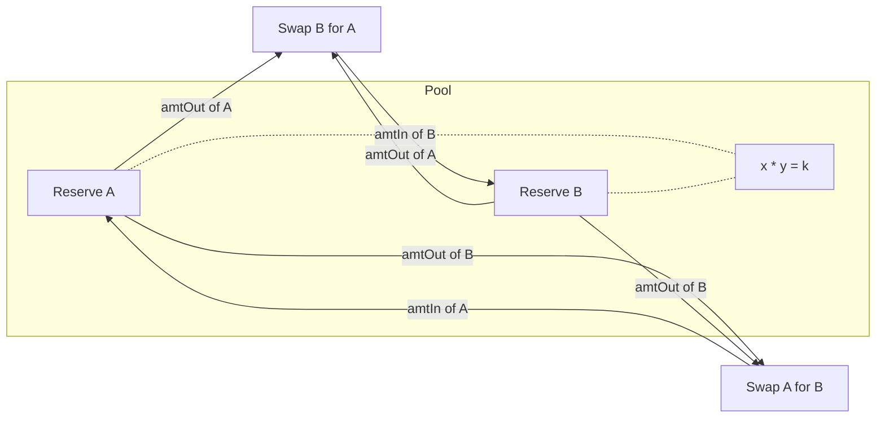

Traders swap tokens against the pool. The output amount is computed from the constant-product formula: `amtOut = reserveY * amtIn / (reserveX + amtIn)` (minus fees). Larger swaps get worse prices (price impact). The pool always has liquidity — swaps never fail due to an empty book.

- **Constant product**: `reserveA * reserveB >= k` (k grows from fees)
- **Price impact**: larger swaps move the price more, getting worse effective rates
- **Fees**: configurable (default 0.3%), accrue to the pool reserves
- **No order book**: price is a function of reserves, not supply/demand matching

**Verified properties:**
| Property | Type | Description |
|---|---|---|
| ConstantProductInvariant | Invariant | `reserveA * reserveB >= initial k` (never decreases) |
| PositiveReserves | Invariant | Pool reserves are always > 0 |
| PositiveSwapOutput | Invariant | Every swap produces output > 0 |
| ConservationOfTokens | Invariant | Total tokens in system (pool + all traders) is constant |

### ImpermanentLoss

Models the economic risk for liquidity providers (LPs) in a constant-product AMM. An LP deposits tokens into the pool, external traders swap against it (moving the price), and the LP's position is compared to simply holding the original tokens. This is the fundamental risk of providing liquidity on [Uniswap](https://docs.uniswap.org/contracts/v2/concepts/advanced-topics/understanding-returns), and why protocols offer "liquidity mining" rewards to compensate LPs.

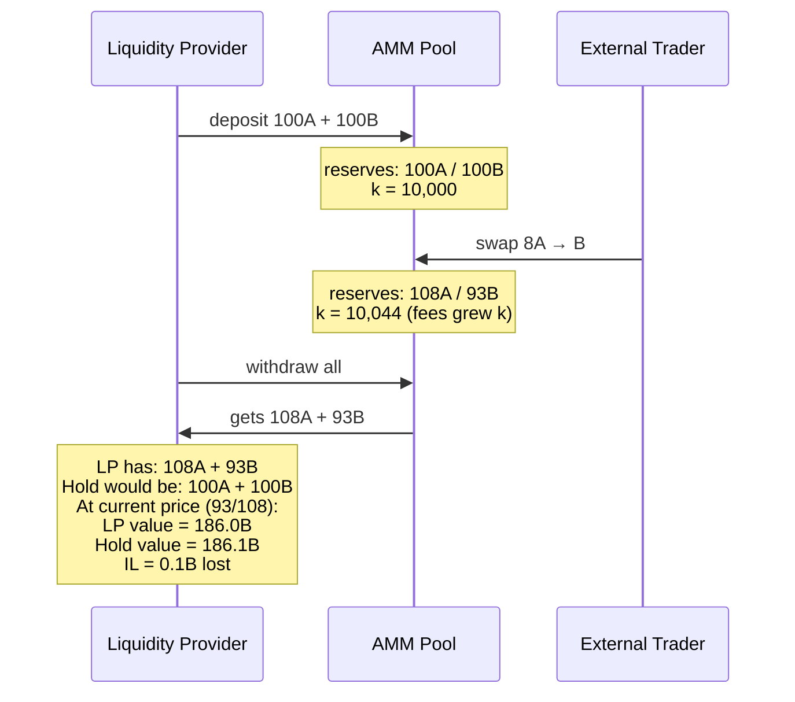

The loss follows from the AM-GM inequality: any change in the price ratio causes the LP's position to underperform holding, even though fees grow the pool (k increases). The loss is "impermanent" because it disappears if the price returns to the original ratio — the LP keeps the fee income.

- **LP deposits**: creates the pool with initial reserves
- **External swaps**: move the price ratio, causing IL
- **Fee income**: k grows with every swap (0.3% fee), partially compensating IL
- **AM-GM inequality**: `2 * reserveA * reserveB < InitReserveA * reserveB + InitReserveB * reserveA` whenever the price ratio changes

**Verified properties (pool correctness):**
| Property | Type | Description |
|---|---|---|
| PositiveReserves | Invariant | Pool reserves always > 0 |
| ConstantProductInvariant | Invariant | `reserveA * reserveB >= initial k` (fees grow k) |

**IL property (expected to fail — add as INVARIANT to see counterexample):**
| Property | Description |
|---|---|
| NoImpermanentLoss | LP's withdrawal value >= holding value at current price (FAILS: one swap of 8A causes IL despite fee income) |

### SandwichAttack

Models the canonical [MEV](https://ethereum.org/en/developers/docs/mev/) (Maximal Extractable Value) attack against a constant-product AMM. An adversary who controls transaction ordering (block builder, sequencer) can extract value from other traders by sandwiching their swaps. This is the primary attack vector against AMMs like Uniswap, and the main motivation behind MEV-resistant designs like [Flashbots](https://www.flashbots.net/), [Penumbra](https://penumbra.zone/), and [CoW Protocol](https://cow.fi/).

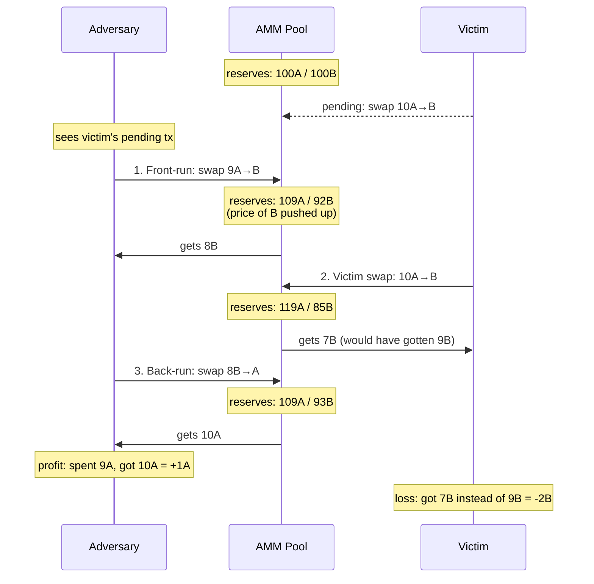

The attack works because AMM pricing is **path-dependent**: the adversary's front-run changes the reserves, making the victim's swap execute at a worse rate. The adversary then converts back at the new favorable rate.

- **Front-run**: adversary swaps in the same direction as victim, moving the price
- **Victim swap**: executes at degraded price due to moved reserves
- **Back-run**: adversary swaps in the opposite direction, capturing the spread
- **Batch auction resistance**: `OrderingIndependence` + `UniformClearingPrice` make sandwiching impossible in BatchedAuction — there is no price to move between trades

**Verified properties (pool correctness):**
| Property | Type | Description |
|---|---|---|
| PositiveReserves | Invariant | Pool reserves always > 0 through the attack |
| ConstantProductInvariant | Invariant | `reserveA * reserveB >= initial k` (fees still grow k) |

**Attack properties (expected to fail — add as INVARIANT to see counterexamples):**
| Property | Description |
|---|---|
| NoPriceDegradation | Victim gets at least as much output as without the attack (FAILS: 7B vs 9B baseline) |
| NoAdversaryProfit | Adversary does not end up with more tokens than they started (FAILS: spent 9A, got back 10A) |

### LatencyArbitrage

Models latency arbitrage between two CLOBs — the core mechanism from [Budish, Cramton, and Shim (2015)](https://faculty.chicagobooth.edu/eric.budish/research/HFT-FrequentBatchAuctions.pdf). When a public signal moves the "true" price, one exchange updates faster than the other. A fast trader snipes the stale quote on the slow exchange before the market maker can update. This models the HFT arms race between NYSE and BATS/IEX, cross-exchange crypto arbitrage (Binance vs Coinbase), and cross-L2 latency (Arbitrum vs Optimism).

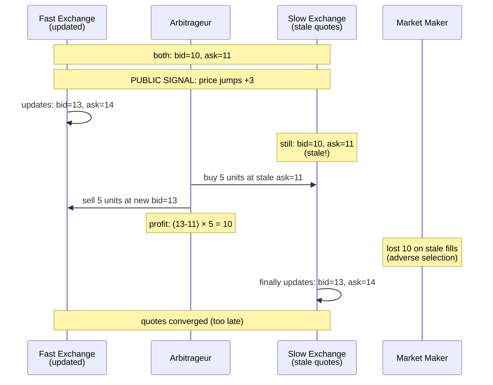

Budish et al.'s argument: continuous limit order books create an arms race where speed advantages translate to sniping profits. Batch auctions eliminate this because all orders in a batch get the same price — there is no stale quote to snipe. Our `BatchedAuction` spec verifies `OrderingIndependence`, confirming that submission timing cannot affect the clearing price.

- **Stale quote sniping**: fast trader exploits latency gap between exchanges
- **Zero-sum**: arbitrageur's profit exactly equals market maker's loss (verified: `ZeroSum`)
- **Quotes converge**: after the slow exchange updates, prices are aligned (verified: `QuotesConverge`)
- **Batch auction solution**: `OrderingIndependence` eliminates the concept of "stale" quotes entirely

**Verified properties:**
| Property | Type | Description |
|---|---|---|
| QuotesConverge | Invariant | After slow exchange updates, both exchanges have identical quotes |
| ZeroSum | Invariant | Arbitrage profit exactly equals market maker loss |

**Latency arbitrage properties (expected to fail — add as INVARIANT to see counterexamples):**
| Property | Description |
|---|---|
| NoArbitrageProfit | No one profits from being faster (FAILS: arb profits 10 by buying at stale 11, selling at 13) |
| MarketMakerNotHarmed | Market makers not harmed by latency (FAILS: MM loses 10 on stale fills = adverse selection) |

### FrontRunning

Models front-running on a CLOB — the CLOB analog of `SandwichAttack` (which targets AMMs). An adversary who controls transaction ordering consumes cheap sell-side liquidity before a victim's buy order, forcing the victim to fill at worse prices. This models HFT latency arbitrage, block builder front-running, and validator front-running in on-chain CLOBs like [dYdX](https://dydx.exchange/) and [Serum/OpenBook](https://www.openbook-solana.com/).

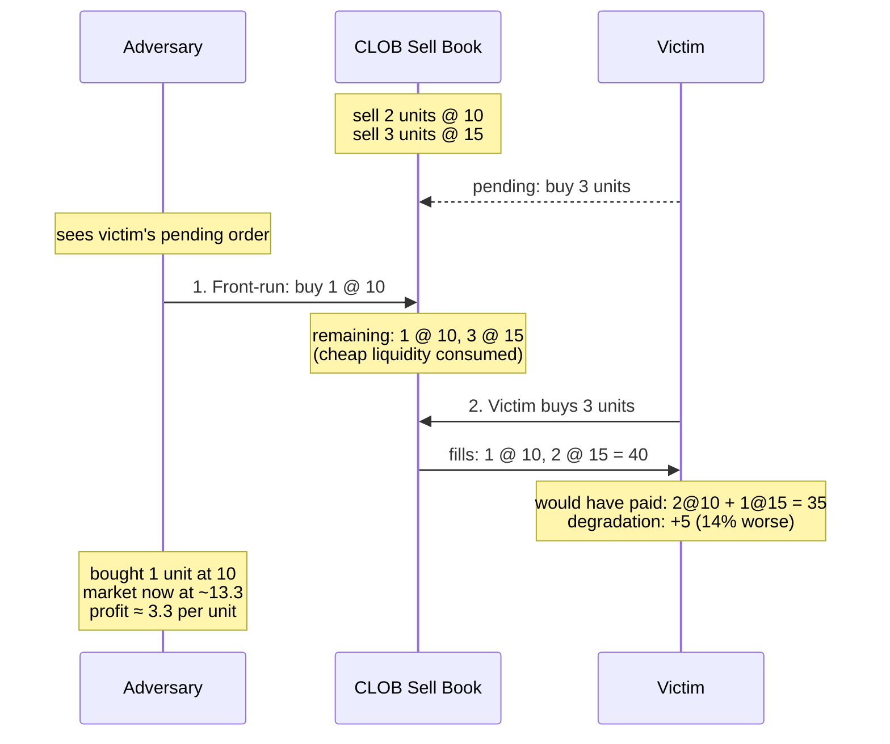

Both AMM sandwiching and CLOB front-running exploit ordering power, but through different mechanisms:
- **AMM sandwich**: adversary shifts the price curve with their own swap
- **CLOB front-run**: adversary depletes cheap resting orders from the book

Both are structurally impossible in `BatchedAuction`/`ZKDarkPool` due to `OrderingIndependence`.

**Verified properties:**
| Property | Type | Description |
|---|---|---|
| VictimFullyFilled | Invariant | Victim always gets their full order filled (enough book liquidity) |

**Attack properties (expected to fail — add as INVARIANT to see counterexamples):**
| Property | Description |
|---|---|
| NoPriceDegradation | Victim pays no more than without front-running (FAILS: pays 40 vs 35 baseline = +14%) |
| NoAdversaryProfit | Adversary cannot profit from information advantage (FAILS: bought at 10, market at ~13.3) |

### CrossVenueArbitrage

Models arbitrage between a CLOB and an AMM trading the same asset. When prices diverge, an arbitrageur buys on the cheap venue and sells on the expensive one, profiting from the difference. Unlike sandwich attacks, this is "productive" MEV — it aligns prices across venues. But the profit comes at the expense of the AMM LP (impermanent loss). This models the CEX/DEX arbitrage that dominates Ethereum MEV: bots like [Wintermute](https://www.wintermute.com/) and [Jump](https://www.jumptrading.com/) continuously arbitrage between centralized exchanges and on-chain AMMs.

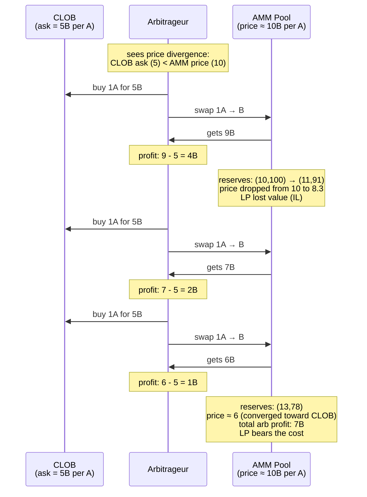

The arbitrageur keeps trading until the AMM price converges to the CLOB range — at which point no more profit is available. TLC verifies that the price always moves in the right direction (`PriceNotDiverging` holds).

- **Atomic trades**: arb buys A on CLOB and sells A on AMM in one step (or vice versa)
- **Two directions**: buy CLOB/sell AMM (when AMM price > CLOB ask) or buy AMM/sell CLOB (when AMM price < CLOB bid)
- **Price convergence**: each arb trade pushes AMM price toward CLOB range (verified)
- **LP cost**: arbitrage-driven trades cause impermanent loss for the AMM LP (same AM-GM formula)

**Verified properties:**
| Property | Type | Description |
|---|---|---|
| PositiveReserves | Invariant | AMM reserves always > 0 |
| ConstantProductInvariant | Invariant | `reserveA * reserveB >= initial k` |
| PriceNotDiverging | Invariant | Arbitrage always pushes AMM price toward CLOB range, never away |

**Arbitrage properties (expected to fail — add as INVARIANT to see counterexamples):**
| Property | Description |
|---|---|
| NoArbitrageProfit | Arbitrageur does not profit (FAILS: buys 1A for 5B on CLOB, sells on AMM for 9B = +4B profit) |
| NoLPValueLoss | AMM LP value is not harmed (FAILS: arb trades cause IL, same formula as ImpermanentLoss) |

### WashTrading

Models wash trading on an AMM: a manipulator trades with themselves (swap A→B then B→A) to inflate reported volume. On a CLOB, self-trade prevention blocks this. On an AMM, there is no counterparty identity — any address can swap. The manipulator loses only fees, but the volume appears genuine on-chain. Estimated 40-70% of DEX volume is wash trading, used to game token listings, airdrops, and liquidity mining rewards.

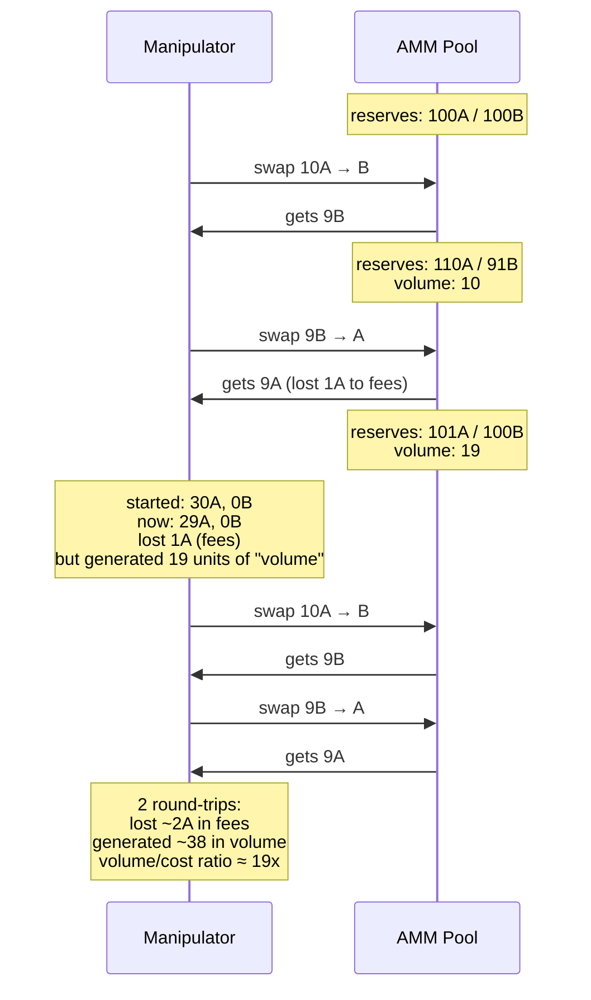

- **No identity check**: AMM swaps are permissionless — anyone can trade, no STP
- **Round-trip cost**: each cycle costs fees (k grows), but cost is small relative to volume generated
- **CLOB resistance**: `NoSelfTrades` invariant in CentralizedCLOB prevents wash trading
- **Batch auction resistance**: `NoSelfTrades` in BatchedAuction/ZKDarkPool also blocks self-trades

**Verified properties (pool correctness):**
| Property | Type | Description |
|---|---|---|
| PositiveReserves | Invariant | Pool reserves always > 0 |
| ConstantProductInvariant | Invariant | `reserveA * reserveB >= initial k` |

**Wash trading properties (expected to fail — add as INVARIANT to see counterexamples):**
| Property | Description |
|---|---|
| NoWashTrading | Volume stays at 0 (FAILS: first swap generates volume immediately) |
| NoManipulatorLoss | Manipulator doesn't lose value (FAILS: 1 round-trip costs 1A in fees, 30A → 29A) |
| VolumeReflectsActivity | Volume = 0 when net position unchanged (FAILS: 19 volume units with zero net change) |

### ZKDarkPool

A sealed-bid batch auction with commit-reveal protocol — also known as a **hidden batch auction**, **encrypted batch auction**, or **sealed-bid batch auction**. This is not a different clearing mechanism from `BatchedAuction`: the clearing logic is identical (uniform price, maximum volume). The difference is an information-hiding layer: orders are sealed during collection and destroyed after clearing. All `BatchedAuction` invariants pass unchanged here, confirming they are structurally the same mechanism — privacy adds MEV resistance on top without altering correctness.

This models privacy-preserving DEXs like [Penumbra](https://penumbra.zone/) (sealed-bid batch auctions with shielded transactions on Cosmos), [Renegade](https://renegade.fi/) (MPC-based dark pool for on-chain private matching), and partially [MEV Blocker](https://mevblocker.io/) / [MEV Share](https://docs.flashbots.net/flashbots-mev-share/overview) (encrypted mempools).

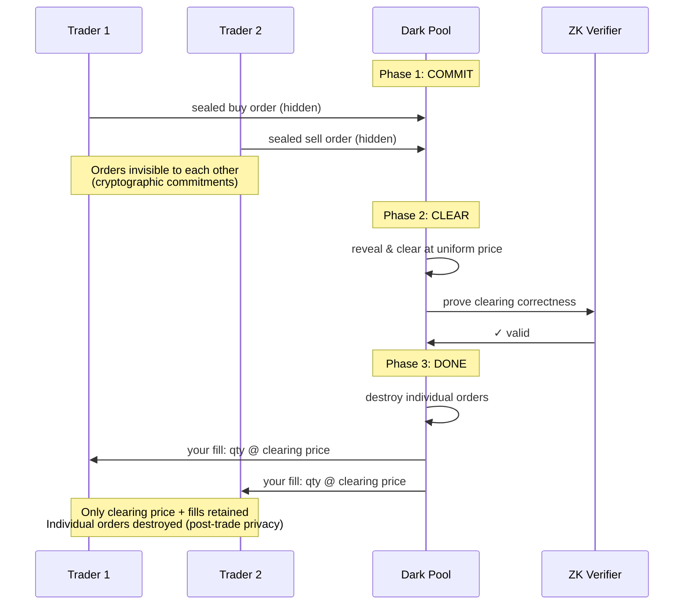

Three phases enforce privacy structurally:
1. **Commit**: traders submit sealed orders — no visibility of others' orders (modeled as nondeterministic choice independent of other orders)
2. **Clear**: orders revealed, uniform-price batch clearing (same algorithm as `BatchedAuction`)
3. **Done**: individual orders destroyed, only clearing price + fills retained (ZK proofs verify correctness)

- **Pre-trade privacy**: order contents hidden during commit phase
- **Commitment binding**: orders cannot be modified after commit
- **Post-trade privacy**: individual orders destroyed after clearing
- **MEV elimination**: sealed bids + uniform price = zero spread to exploit = sandwich attacks impossible

**Verified properties:**
| Property | Type | Description |
|---|---|---|
| UniformClearingPrice | Invariant | All trades execute at the same clearing price |
| PriceImprovement | Invariant | Trade price within both parties' limits |
| PositiveTradeQuantities | Invariant | Every trade has quantity > 0 |
| NoSelfTrades | Invariant | No trade has the same buyer and seller |
| OrderingIndependence | Invariant | Clearing result is the same regardless of commit order |
| NoSpreadArbitrage | Invariant | Zero spread within the batch — no price difference to exploit |
| SandwichResistant | Invariant | Trader with both buy and sell fills gets the same price on both sides (zero profit from sandwich pattern) |
| PostTradeOrdersDestroyed | Invariant | After clearing, individual orders are destroyed (only clearing price + fills retained) |
| EventualClearing | Liveness | If the batch is ready to clear, it eventually clears |

### ZKRefinement

Formal refinement proof: ZKDarkPool implements BatchedAuction. This module instantiates `BatchedAuction` with a variable mapping from `ZKDarkPool`'s state, then verifies that all BatchedAuction invariants hold under the mapping. This is the TLA+ native way to prove that two specifications describe the same mechanism.

**Variable mapping (ZKDarkPool → BatchedAuction):**
| ZKDarkPool | BatchedAuction |
|---|---|
| `phase = "commit"` | `phase = "collecting"` |
| `phase = "clear"` | `phase = "clearing"` |
| `phase = "done"` | `phase = "collecting"`, `batch = 1` |
| `clearPrice` | `lastClearPrice` |
| `buyOrders`, `sellOrders`, `trades`, `nextOrderId` | same |

**Verified: all 6 BatchedAuction invariants hold on ZKDarkPool's state space:**
| Refined Property | Status |
|---|---|
| `BA!UniformClearingPrice` | Pass (8,735 states) |
| `BA!PriceImprovement` | Pass |
| `BA!PositiveTradeQuantities` | Pass |
| `BA!NoSelfTrades` | Pass |
| `BA!OrderingIndependence` | Pass |
| `BA!NoSpreadArbitrage` | Pass |

This confirms that privacy (sealed bids + post-trade order destruction) is a pure addition — it does not alter the clearing mechanism in any way. ZKDarkPool = BatchedAuction + information hiding.

### DecentralizedCLOB

Multiple nodes each maintain independent order books. Orders are submitted to a global pool and delivered to nodes in nondeterministic order — modeling network propagation delay. Each node runs the same price-time priority matching engine as `CentralizedCLOB`. This models on-chain order books like [Serum/OpenBook](https://www.openbook-solana.com/) (Solana), [dYdX v4](https://dydx.exchange/) (Cosmos app-chain where validators run matching), [Hyperliquid](https://hyperliquid.xyz/) (L1 with on-chain order book), and [Injective](https://injective.com/) (Cosmos chain).

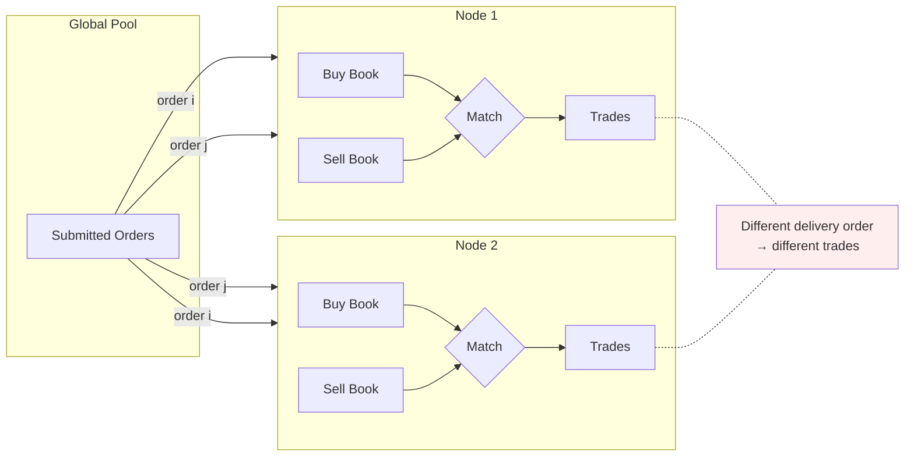

The core problem: without consensus on ordering, different nodes process the same orders in different sequences and **arrive at different results**. TLC proves this is not just a theoretical concern — it finds concrete traces where the same set of orders produces different trades (or no trades at all) at different nodes.

- **Per-node matching**: same CLOB logic (price-time priority, ask price execution)
- **Nondeterministic delivery**: any node can receive any unprocessed order next
- **Self-trade interaction**: delivery order determines which orders get priority, and self-trade prevention can block matches that would succeed in a different sequence

**Verified properties (per-node correctness):**
| Property | Type | Description |
|---|---|---|
| PositiveBookQuantities | Invariant | Every resting order on every node has quantity > 0 |
| PositiveTradeQuantities | Invariant | Every trade at every node has quantity > 0 |
| PriceImprovement | Invariant | Price improvement holds at every node |
| NoSelfTrades | Invariant | No self-trades at any node |

**Consensus properties (expected to fail — add as INVARIANT to see counterexamples):**
| Property | Description |
|---|---|
| ConsensusOnTrades | After all orders delivered and matched, all nodes have identical trade logs |
| ConsensusOnPrices | All nodes agree on the set of trade prices |
| ConsensusOnVolume | All nodes agree on the number of trades |

## Comparison

Same orders, different outcomes:

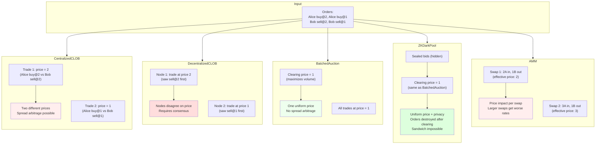

The key structural differences, verified by TLC:

| Property | CentralizedCLOB | DecentralizedCLOB | BatchedAuction | ZKDarkPool | AMM |
|---|---|---|---|---|---|
| Uniform pricing | No | No | Yes (verified) | Yes (verified) | No |
| Ordering independence | No (price-time priority) | No (delivery order) | Yes (verified) | Yes (verified) | No (price impact) |
| Cross-node consensus | N/A (single node) | No (TLC counterexample) | Yes (ordering independence) | Yes (ordering independence) | N/A (single pool) |
| Spread arbitrage possible | Yes | Yes | No (uniform price) | No (uniform price) | Yes (price impact) |
| Front-running resistant | No (TLC counterexample) | No (ordering power) | Yes (ordering independence) | Yes (ordering independence) | N/A (no order book) |
| Wash trading resistant | Yes (self-trade prevention) | Yes (self-trade prevention) | Yes (self-trade prevention) | Yes (self-trade prevention) | No (no identity check) |
| Sandwich attack resistant | N/A (off-chain) | No (ordering power) | Yes (uniform price) | Yes (verified: SandwichResistant) | No (TLC counterexample) |
| Pre-trade privacy | No | No | No | Yes (sealed bids) | No |
| Post-trade privacy | No | No | No | Yes (verified: orders destroyed) | No |
| Always-available liquidity | No (book can be empty) | No (book can be empty) | No (batch can be empty) | No (batch can be empty) | Yes (verified) |
| Price improvement | Yes (verified) | Yes (per-node, verified) | Yes (verified) | Yes (verified) | N/A (no limit prices) |
| Cross-venue arbitrage | Source venue | Source venue | Resistant (uniform price) | Resistant (uniform price + privacy) | Target venue (LP bears cost) |
| LP impermanent loss | N/A | N/A | N/A | N/A | Yes (TLC counterexample) |
| Constant product (k) | N/A | N/A | N/A | N/A | Yes (verified) |
| Conservation | Yes (verified) | Yes (per-node) | Yes (verified) | Yes (verified) | Yes (verified) |

To see counterexamples:
- **CLOB non-uniform pricing**: add `INVARIANT AllTradesSamePrice` to `CentralizedCLOB.cfg` (with `MaxTime = 4`, `MaxOrders = 4`)
- **AMM non-uniform pricing**: add `INVARIANT AllSwapsSamePrice` to `AMM.cfg` (with `MaxTime = 4`)
- **Decentralized CLOB divergence**: add `INVARIANT ConsensusOnTrades` (or `ConsensusOnPrices`, `ConsensusOnVolume`) to `DecentralizedCLOB.cfg`
- **Latency arbitrage**: add `INVARIANT NoArbitrageProfit` or `INVARIANT MarketMakerNotHarmed` to `LatencyArbitrage.cfg`
- **CLOB front-running**: add `INVARIANT NoPriceDegradation` or `INVARIANT NoAdversaryProfit` to `FrontRunning.cfg`
- **Wash trading**: add `INVARIANT NoWashTrading`, `INVARIANT NoManipulatorLoss`, or `INVARIANT VolumeReflectsActivity` to `WashTrading.cfg`
- **Sandwich attack**: add `INVARIANT NoPriceDegradation` or `INVARIANT NoAdversaryProfit` to `SandwichAttack.cfg`
- **Impermanent loss**: add `INVARIANT NoImpermanentLoss` to `ImpermanentLoss.cfg`
- **Cross-venue arbitrage profit**: add `INVARIANT NoArbitrageProfit` or `INVARIANT NoLPValueLoss` to `CrossVenueArbitrage.cfg`

## Conclusions

The formal verification reveals a fundamental three-way trade-off between **fairness**, **liquidity**, and **immediacy**. No mechanism dominates — each one guarantees properties the others provably cannot.

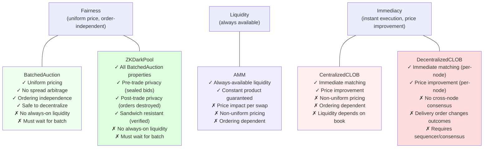

**What TLC proves (not just argues):**

| Conclusion | Evidence |
|---|---|
| Batched auctions eliminate spread arbitrage | `NoSpreadArbitrage` and `UniformClearingPrice` hold across all reachable states |
| Submission order cannot affect batch outcomes | `OrderingIndependence` verified — same orders in any sequence produce same clearing price |
| Batch auctions are safe to decentralize | `OrderingIndependence` means validators only need consensus on the order **set**, not sequence (Penumbra, CoW Protocol) |
| CLOBs produce different prices for the same set of orders | TLC counterexample: two trades at prices 1 and 2 from identical order set |
| Decentralizing a CLOB breaks consensus | TLC counterexample: same orders delivered in different sequence → one node executes a trade, the other executes none |
| AMM price depends on swap ordering and size | TLC counterexample: same input amounts yield different output amounts depending on reserve state |
| CLOB latency differences enable sniping profits | TLC counterexample: price jumps +3, arb buys 5 at stale ask 11 and sells at new bid 13 = profit 10; MM bears the loss (zero-sum verified) |
| Batch auctions eliminate latency arbitrage (Budish et al.) | `OrderingIndependence` means there are no stale quotes to snipe — all orders clear at the same price regardless of timing |
| CLOBs are vulnerable to front-running | TLC counterexample: adversary buys 1 unit at 10, victim pays 40 instead of 35 (14% degradation); adversary profits from buying below market |
| AMMs are vulnerable to wash trading | TLC counterexample: 1 round-trip generates 19 units of volume at cost of 1A in fees; no identity check to prevent self-trading |
| AMMs are vulnerable to sandwich attacks | TLC counterexample: adversary extracts 1A profit while victim loses 2B (22% worse output) |
| Batch auctions resist sandwich attacks | `OrderingIndependence` + `UniformClearingPrice` — no price to move between trades |
| AMM LPs face impermanent loss from any price movement | TLC counterexample: single swap of 8A causes IL despite fees growing k from 10,000 to 10,044 |
| Cross-venue arbitrage profits at LP's expense | TLC counterexample: arb buys A on CLOB for 5B, sells on AMM for 9B; LP bears the IL. Price converges (verified: `PriceNotDiverging`) |
| ZK dark pools inherit all batch auction guarantees | `UniformClearingPrice`, `OrderingIndependence`, `NoSpreadArbitrage` all verified for ZKDarkPool (same clearing logic) |
| Sealed bids + uniform price makes sandwich attacks provably impossible | `SandwichResistant` verified: any trader with both buy and sell fills gets the same price on both sides — zero profit from sandwich pattern |
| Post-trade privacy is structurally enforced | `PostTradeOrdersDestroyed` verified: after clearing, `buyOrders = <<>>` and `sellOrders = <<>>` — individual orders are destroyed, only clearing price + fills retained |
| ZKDarkPool is a formal refinement of BatchedAuction | All 6 BatchedAuction invariants pass on ZKDarkPool's state space via INSTANCE variable mapping (ZKRefinement.tla) — privacy is a pure addition, not a mechanism change |
| AMM liquidity never runs out | `PositiveReserves` + `PositiveSwapOutput` hold in all states — swaps always succeed |
| All four mechanisms conserve assets (per-node) | `ConservationOfAssets` / `ConservationOfTokens` verified for each |

**The impossibility triangle:** a mechanism that clears at a uniform price (fairness) must collect orders before clearing, sacrificing immediacy. A mechanism that always has liquidity (AMM) must price algorithmically, creating price impact that depends on ordering. A mechanism that matches immediately (CLOB) exposes different prices to different participants, enabling spread arbitrage. These are structural constraints, not implementation choices — they follow from the definitions of the mechanisms themselves.

**Privacy as MEV resistance:** the ZKDarkPool spec demonstrates that adding privacy (sealed bids + post-trade order destruction) to a batch auction doesn't change any correctness property — all `BatchedAuction` invariants carry over — but adds a new dimension: MEV elimination through information hiding. The `SandwichResistant` invariant proves that the sandwich attack pattern (which succeeds against AMMs in `SandwichAttack.tla`) is structurally impossible when orders are sealed and cleared at a uniform price. Privacy is not just a feature — it's a mechanism design tool that eliminates the information asymmetry attackers need.

**Centralization vs decentralization:** the DecentralizedCLOB spec shows that continuous matching is fundamentally order-dependent — decentralizing it without consensus on transaction ordering leads to divergent state across nodes. This is why real-world decentralized CLOBs (dYdX v4, Hyperliquid) run their own chains with a single sequencer or validator-based consensus to impose a total order. Batched auctions avoid this problem entirely because clearing is order-independent.

## Shared

`Common.tla` contains reusable definitions across all mechanisms:
- Order tuple accessors: `OTrader`, `OPrice`, `OQty`, `OId`, `OTime`
- Trade tuple accessors: `TBuyer`, `TSeller`, `TPrice`, `TQty`, `TTime`, `TBuyLimit`, `TSellLimit`
- Sequence helpers: `RemoveAt`, `ReplaceAt`
- Arithmetic helpers: `Min`, `Max`

## Running

Requires Java and [tla2tools.jar](https://github.com/tlaplus/tlaplus/releases). From the `specs/` directory:

```bash
java -DTLC -cp /path/to/tla2tools.jar tlc2.TLC CentralizedCLOB -config CentralizedCLOB.cfg -modelcheck
java -DTLC -cp /path/to/tla2tools.jar tlc2.TLC BatchedAuction -config BatchedAuction.cfg -modelcheck
java -DTLC -cp /path/to/tla2tools.jar tlc2.TLC AMM -config AMM.cfg -modelcheck
java -DTLC -cp /path/to/tla2tools.jar tlc2.TLC DecentralizedCLOB -config DecentralizedCLOB.cfg -modelcheck
java -DTLC -cp /path/to/tla2tools.jar tlc2.TLC LatencyArbitrage -config LatencyArbitrage.cfg -modelcheck
java -DTLC -cp /path/to/tla2tools.jar tlc2.TLC FrontRunning -config FrontRunning.cfg -modelcheck
java -DTLC -cp /path/to/tla2tools.jar tlc2.TLC WashTrading -config WashTrading.cfg -modelcheck
java -DTLC -cp /path/to/tla2tools.jar tlc2.TLC SandwichAttack -config SandwichAttack.cfg -modelcheck
java -DTLC -cp /path/to/tla2tools.jar tlc2.TLC ImpermanentLoss -config ImpermanentLoss.cfg -modelcheck
java -DTLC -cp /path/to/tla2tools.jar tlc2.TLC CrossVenueArbitrage -config CrossVenueArbitrage.cfg -modelcheck
java -DTLC -cp /path/to/tla2tools.jar tlc2.TLC ZKDarkPool -config ZKDarkPool.cfg -modelcheck
java -DTLC -cp /path/to/tla2tools.jar tlc2.TLC ZKRefinement -config ZKRefinement.cfg -modelcheck
```

Or use the [TLA+ VS Code extension](https://marketplace.visualstudio.com/items?itemName=tlaplus.vscode-tlaplus).

## References

| Mechanism | Real-world systems |
|---|---|
| CentralizedCLOB | NYSE, NASDAQ, CME, Binance, Coinbase |
| BatchedAuction | [Penumbra](https://penumbra.zone/), [CoW Protocol](https://cow.fi/), NYSE/NASDAQ opening & closing auctions |
| AMM | [Uniswap v2](https://docs.uniswap.org/contracts/v2/overview), SushiSwap, PancakeSwap, [Curve](https://curve.fi/), [Balancer](https://balancer.fi/) |
| ZKDarkPool | [Penumbra](https://penumbra.zone/), [Renegade](https://renegade.fi/), [MEV Blocker](https://mevblocker.io/), [MEV Share](https://docs.flashbots.net/flashbots-mev-share/overview) |
| DecentralizedCLOB | [Serum/OpenBook](https://www.openbook-solana.com/), [dYdX v4](https://dydx.exchange/), [Hyperliquid](https://hyperliquid.xyz/), [Injective](https://injective.com/) |

**Academic:**
- Budish, Cramton, Shim — "[The High-Frequency Trading Arms Race](https://faculty.chicagobooth.edu/eric.budish/research/HFT-FrequentBatchAuctions.pdf)" (2015) — proposes frequent batch auctions to eliminate latency arbitrage

## Planned

- **Triangular arbitrage** - A→B→C→A price cycles within a single venue, multi-asset extension
- Privacy/visibility model across all mechanisms (extending ZKDarkPool's approach)
- Adversarial conditions and manipulation resistance analysis
