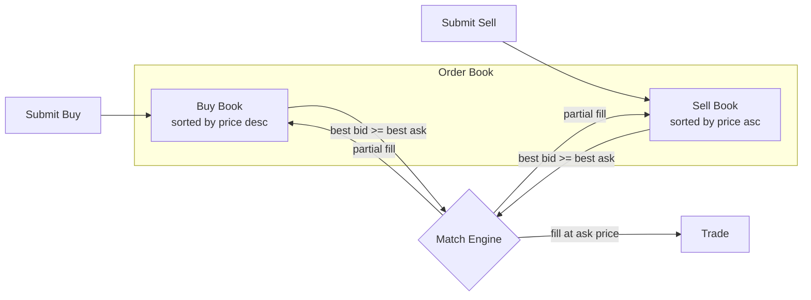
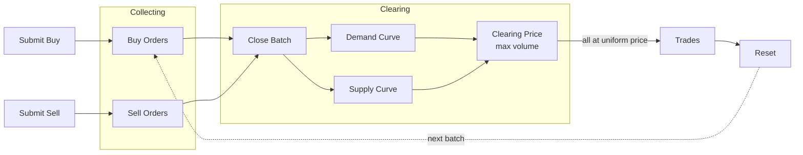
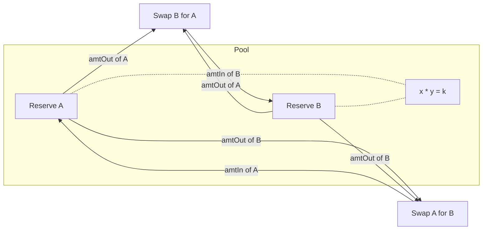
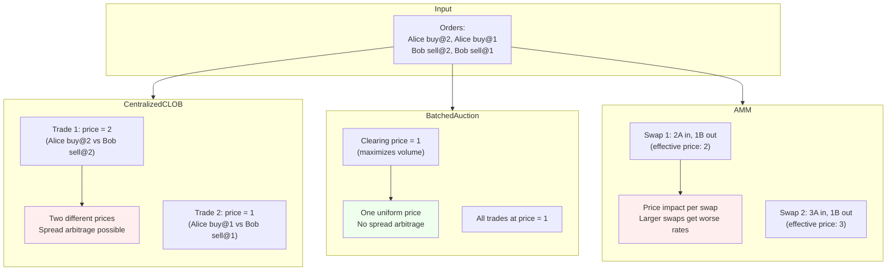
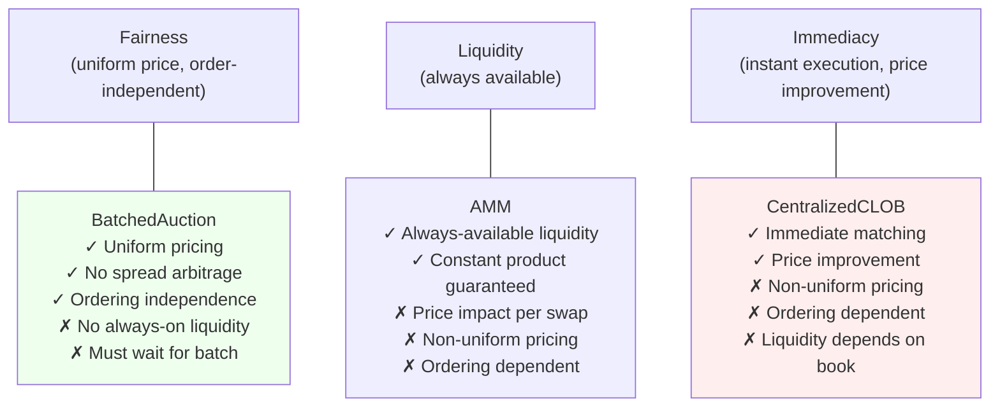

# Formal Market Mechanisms

TLA+ specifications for comparing market mechanisms. The goal is to formally verify correctness properties and compare structural differences across centralized, decentralized, continuous, and batched trading systems.

## Mechanisms

### CentralizedCLOB

A continuous limit order book with a single matching engine. Orders are matched immediately using price-time priority.



Each order is matched **immediately** on arrival. The trade executes at the resting order's price. Different trades can execute at different prices (enabling spread arbitrage).

- **Matching**: best bid vs best ask, executes at the ask (resting order) price
- **Partial fills**: smaller side is fully filled, larger side's quantity is reduced
- **Self-trade prevention**: a trader cannot match against themselves

**Verified properties:**
| Property | Type | Description |
|---|---|---|
| PositiveBookQuantities | Invariant | Every resting order has quantity > 0 |
| PositiveTradeQuantities | Invariant | Every trade has quantity > 0 |
| PriceImprovement | Invariant | Trade price <= buyer's limit and >= seller's limit |
| NoSelfTrades | Invariant | No trade has the same buyer and seller |
| UniqueOrderIds | Invariant | All order IDs on the books are distinct |
| ConservationOfAssets | Invariant | Trade log is consistent across traders |
| EventualMatching | Liveness | Crossed books between different traders are eventually resolved |

### BatchedAuction

A periodic auction that collects orders over a batch window, then clears all at a single uniform price that maximizes traded volume.



Orders accumulate during the **collection phase** without matching. When the batch closes, a single **clearing price** is computed that maximizes traded volume. All trades execute at this uniform price — no spread to capture.

- **Collection phase**: orders accumulate without matching
- **Clearing phase**: compute clearing price from aggregate supply/demand curves, fill eligible orders at the uniform price
- **Self-trade prevention**: buyer-seller pairs with the same trader are skipped during clearing

**Verified properties:**
| Property | Type | Description |
|---|---|---|
| UniformClearingPrice | Invariant | All trades in a batch execute at the same price |
| PriceImprovement | Invariant | Trade price <= buyer's limit and >= seller's limit |
| PositiveTradeQuantities | Invariant | Every trade has quantity > 0 |
| NoSelfTrades | Invariant | No trade has the same buyer and seller |
| OrderingIndependence | Invariant | Clearing result matches the deterministic clearing price regardless of submission order |
| NoSpreadArbitrage | Invariant | No price difference to exploit within a batch |
| EventualClearing | Liveness | Every batch eventually clears |

### AMM (Automated Market Maker)

A constant-product market maker (x*y=k). No order book — traders swap against a liquidity pool. Price is determined by the reserve ratio, not by matching orders.



Traders swap tokens against the pool. The output amount is computed from the constant-product formula: `amtOut = reserveY * amtIn / (reserveX + amtIn)` (minus fees). Larger swaps get worse prices (price impact). The pool always has liquidity — swaps never fail due to an empty book.

- **Constant product**: `reserveA * reserveB >= k` (k grows from fees)
- **Price impact**: larger swaps move the price more, getting worse effective rates
- **Fees**: configurable (default 0.3%), accrue to the pool reserves
- **No order book**: price is a function of reserves, not supply/demand matching

**Verified properties:**
| Property | Type | Description |
|---|---|---|
| ConstantProductInvariant | Invariant | `reserveA * reserveB >= initial k` (never decreases) |
| PositiveReserves | Invariant | Pool reserves are always > 0 |
| PositiveSwapOutput | Invariant | Every swap produces output > 0 |
| ConservationOfTokens | Invariant | Total tokens in system (pool + all traders) is constant |

## Comparison

Same orders, different outcomes:



The key structural differences, verified by TLC:

| Property | CentralizedCLOB | BatchedAuction | AMM |
|---|---|---|---|
| Uniform pricing | No | Yes (verified) | No |
| Ordering independence | No (price-time priority) | Yes (verified) | No (price impact) |
| Spread arbitrage possible | Yes | No (uniform price) | Yes (price impact) |
| Always-available liquidity | No (book can be empty) | No (batch can be empty) | Yes (verified) |
| Price improvement | Yes (verified) | Yes (verified) | N/A (no limit prices) |
| Constant product (k) | N/A | N/A | Yes (verified) |
| Conservation | Yes (verified) | Yes (verified) | Yes (verified) |

To see counterexamples:
- **CLOB non-uniform pricing**: add `INVARIANT AllTradesSamePrice` to `CentralizedCLOB.cfg` (with `MaxTime = 4`, `MaxOrders = 4`)
- **AMM non-uniform pricing**: add `INVARIANT AllSwapsSamePrice` to `AMM.cfg` (with `MaxTime = 4`)

## Conclusions

The formal verification reveals a fundamental three-way trade-off between **fairness**, **liquidity**, and **immediacy**. No mechanism dominates — each one guarantees properties the others provably cannot.



**What TLC proves (not just argues):**

| Conclusion | Evidence |
|---|---|
| Batched auctions eliminate spread arbitrage | `NoSpreadArbitrage` and `UniformClearingPrice` hold across all reachable states |
| Submission order cannot affect batch outcomes | `OrderingIndependence` verified — same orders in any sequence produce same clearing price |
| CLOBs produce different prices for the same set of orders | TLC counterexample: two trades at prices 1 and 2 from identical order set |
| AMM price depends on swap ordering and size | TLC counterexample: same input amounts yield different output amounts depending on reserve state |
| AMM liquidity never runs out | `PositiveReserves` + `PositiveSwapOutput` hold in all states — swaps always succeed |
| All three mechanisms conserve assets | `ConservationOfAssets` / `ConservationOfTokens` verified for each |

**The impossibility triangle:** a mechanism that clears at a uniform price (fairness) must collect orders before clearing, sacrificing immediacy. A mechanism that always has liquidity (AMM) must price algorithmically, creating price impact that depends on ordering. A mechanism that matches immediately (CLOB) exposes different prices to different participants, enabling spread arbitrage. These are structural constraints, not implementation choices — they follow from the definitions of the mechanisms themselves.

## Shared

`Common.tla` contains reusable definitions across all mechanisms:
- Order tuple accessors: `OTrader`, `OPrice`, `OQty`, `OId`, `OTime`
- Trade tuple accessors: `TBuyer`, `TSeller`, `TPrice`, `TQty`, `TTime`, `TBuyLimit`, `TSellLimit`
- Sequence helpers: `RemoveAt`, `ReplaceAt`
- Arithmetic helpers: `Min`, `Max`

## Running

Requires Java and [tla2tools.jar](https://github.com/tlaplus/tlaplus/releases). From the `specs/` directory:

```bash
java -DTLC -cp /path/to/tla2tools.jar tlc2.TLC CentralizedCLOB -config CentralizedCLOB.cfg -modelcheck
java -DTLC -cp /path/to/tla2tools.jar tlc2.TLC BatchedAuction -config BatchedAuction.cfg -modelcheck
java -DTLC -cp /path/to/tla2tools.jar tlc2.TLC AMM -config AMM.cfg -modelcheck
```

Or use the [TLA+ VS Code extension](https://marketplace.visualstudio.com/items?itemName=tlaplus.vscode-tlaplus).

## Planned

- **AMM sandwich attack traces** - model front-running and sandwich attacks against the AMM
- **Decentralized CLOB** - multiple nodes, ordering ambiguity, consensus
- **ZK Dark Pool** - verifiable private matching, encrypted order visibility
- Privacy/visibility model across all mechanisms
- Adversarial conditions and manipulation resistance analysis
