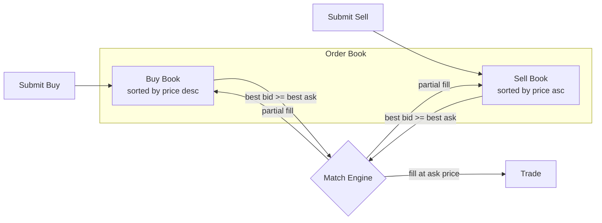
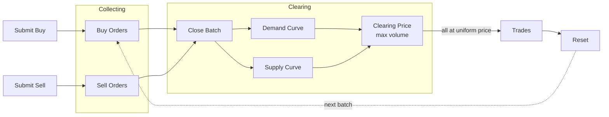
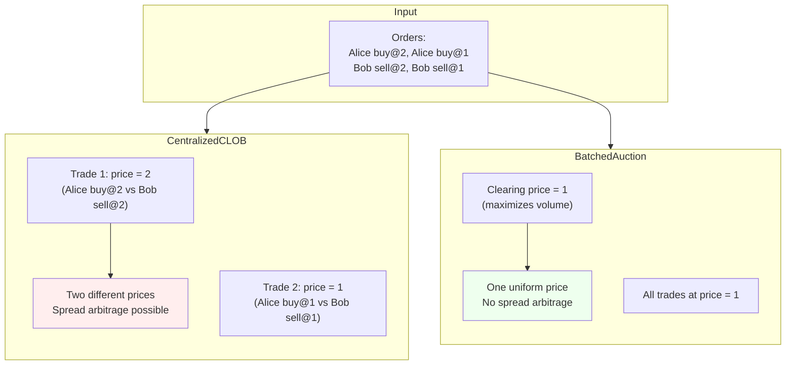

# Formal Market Mechanisms

TLA+ specifications for comparing market mechanisms. The goal is to formally verify correctness properties and compare structural differences across centralized, decentralized, continuous, and batched trading systems.

## Mechanisms

### CentralizedCLOB

A continuous limit order book with a single matching engine. Orders are matched immediately using price-time priority.



Each order is matched **immediately** on arrival. The trade executes at the resting order's price. Different trades can execute at different prices (enabling spread arbitrage).

- **Matching**: best bid vs best ask, executes at the ask (resting order) price
- **Partial fills**: smaller side is fully filled, larger side's quantity is reduced
- **Self-trade prevention**: a trader cannot match against themselves

**Verified properties:**
| Property | Type | Description |
|---|---|---|
| PositiveBookQuantities | Invariant | Every resting order has quantity > 0 |
| PositiveTradeQuantities | Invariant | Every trade has quantity > 0 |
| PriceImprovement | Invariant | Trade price <= buyer's limit and >= seller's limit |
| NoSelfTrades | Invariant | No trade has the same buyer and seller |
| UniqueOrderIds | Invariant | All order IDs on the books are distinct |
| ConservationOfAssets | Invariant | Trade log is consistent across traders |
| EventualMatching | Liveness | Crossed books between different traders are eventually resolved |

### BatchedAuction

A periodic auction that collects orders over a batch window, then clears all at a single uniform price that maximizes traded volume.



Orders accumulate during the **collection phase** without matching. When the batch closes, a single **clearing price** is computed that maximizes traded volume. All trades execute at this uniform price — no spread to capture.

- **Collection phase**: orders accumulate without matching
- **Clearing phase**: compute clearing price from aggregate supply/demand curves, fill eligible orders at the uniform price
- **Self-trade prevention**: buyer-seller pairs with the same trader are skipped during clearing

**Verified properties:**
| Property | Type | Description |
|---|---|---|
| UniformClearingPrice | Invariant | All trades in a batch execute at the same price |
| PriceImprovement | Invariant | Trade price <= buyer's limit and >= seller's limit |
| PositiveTradeQuantities | Invariant | Every trade has quantity > 0 |
| NoSelfTrades | Invariant | No trade has the same buyer and seller |
| OrderingIndependence | Invariant | Clearing result matches the deterministic clearing price regardless of submission order |
| NoSpreadArbitrage | Invariant | No price difference to exploit within a batch |
| EventualClearing | Liveness | Every batch eventually clears |

## Comparison

Same orders, different outcomes:



The key structural difference, verified by TLC:

| Property | CentralizedCLOB | BatchedAuction |
|---|---|---|
| Uniform pricing | No (TLC finds counterexample) | Yes (verified) |
| Ordering independence | No (price-time priority) | Yes (verified) |
| Spread arbitrage possible | Yes (different trade prices) | No (uniform price) |
| Price improvement | Yes (verified) | Yes (verified) |
| Self-trade prevention | Yes (verified) | Yes (verified) |

To see the CLOB counterexample: add `INVARIANT AllTradesSamePrice` to `CentralizedCLOB.cfg` (with `MaxTime = 4`, `MaxOrders = 4`). TLC will produce a trace with two trades at different prices.

## Shared

`Common.tla` contains reusable definitions across all mechanisms:
- Order tuple accessors: `OTrader`, `OPrice`, `OQty`, `OId`, `OTime`
- Trade tuple accessors: `TBuyer`, `TSeller`, `TPrice`, `TQty`, `TTime`, `TBuyLimit`, `TSellLimit`
- Sequence helpers: `RemoveAt`, `ReplaceAt`
- Arithmetic helpers: `Min`, `Max`

## Running

Requires Java and [tla2tools.jar](https://github.com/tlaplus/tlaplus/releases). From the `specs/` directory:

```bash
java -DTLC -cp /path/to/tla2tools.jar tlc2.TLC CentralizedCLOB -config CentralizedCLOB.cfg -modelcheck
java -DTLC -cp /path/to/tla2tools.jar tlc2.TLC BatchedAuction -config BatchedAuction.cfg -modelcheck
```

Or use the [TLA+ VS Code extension](https://marketplace.visualstudio.com/items?itemName=tlaplus.vscode-tlaplus).

## Planned

- **AMM (Automated Market Maker)** - constant-product (x*y=k) model, sandwich attack traces
- **Decentralized CLOB** - multiple nodes, ordering ambiguity, consensus
- **ZK Dark Pool** - verifiable private matching, encrypted order visibility
- Privacy/visibility model across all mechanisms
- Adversarial conditions and manipulation resistance analysis
