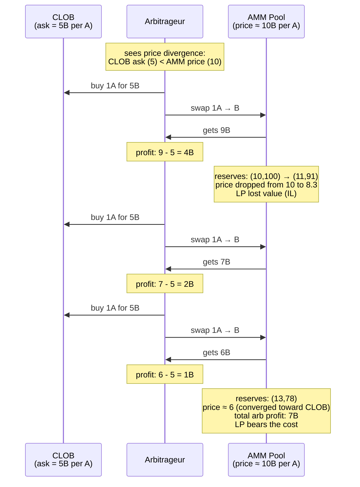

# CrossVenueArbitrage

[spec](https://github.com/alfredogarcia/formal-market-mechanisms/blob/main/specs/CrossVenueArbitrage.tla) · [config](https://github.com/alfredogarcia/formal-market-mechanisms/blob/main/specs/CrossVenueArbitrage.cfg)

Models arbitrage between a CLOB and an AMM trading the same asset. When prices diverge, an arbitrageur buys on the cheap venue and sells on the expensive one, profiting from the difference. Unlike sandwich attacks, this is "productive" MEV — it aligns prices across venues. But the profit comes at the expense of the AMM LP (impermanent loss). This models the CEX/DEX arbitrage that dominates Ethereum MEV: bots like [Wintermute](https://www.wintermute.com/) and [Jump](https://www.jumptrading.com/) continuously arbitrage between centralized exchanges and on-chain AMMs.

The arbitrageur keeps trading until the AMM price converges to the CLOB range — at which point no more profit is available. TLC verifies that the price always moves in the right direction (`PriceNotDiverging` holds).

- **Atomic trades**: arb buys A on CLOB and sells A on AMM in one step (or vice versa)
- **Two directions**: buy CLOB/sell AMM (when AMM price > CLOB ask) or buy AMM/sell CLOB (when AMM price < CLOB bid)
- **Price convergence**: each arb trade pushes AMM price toward CLOB range (verified)
- **LP cost**: arbitrage-driven trades cause impermanent loss for the AMM LP (same AM-GM formula)

## Verified properties

| Property | Type | Description |
|---|---|---|
| PositiveReserves | Invariant | AMM reserves always > 0 |
| ConstantProductInvariant | Invariant | `reserveA * reserveB >= initial k` |
| PriceNotDiverging | Invariant | Arbitrage always pushes AMM price toward CLOB range, never away |

## Arbitrage properties (expected to fail)

Add as INVARIANT to see counterexamples:

| Property | Description |
|---|---|
| NoArbitrageProfit | Arbitrageur does not profit (FAILS: buys 1A for 5B on CLOB, sells on AMM for 9B = +4B profit) |
| NoLPValueLoss | AMM LP value is not harmed (FAILS: arb trades cause IL, same formula as ImpermanentLoss) |
