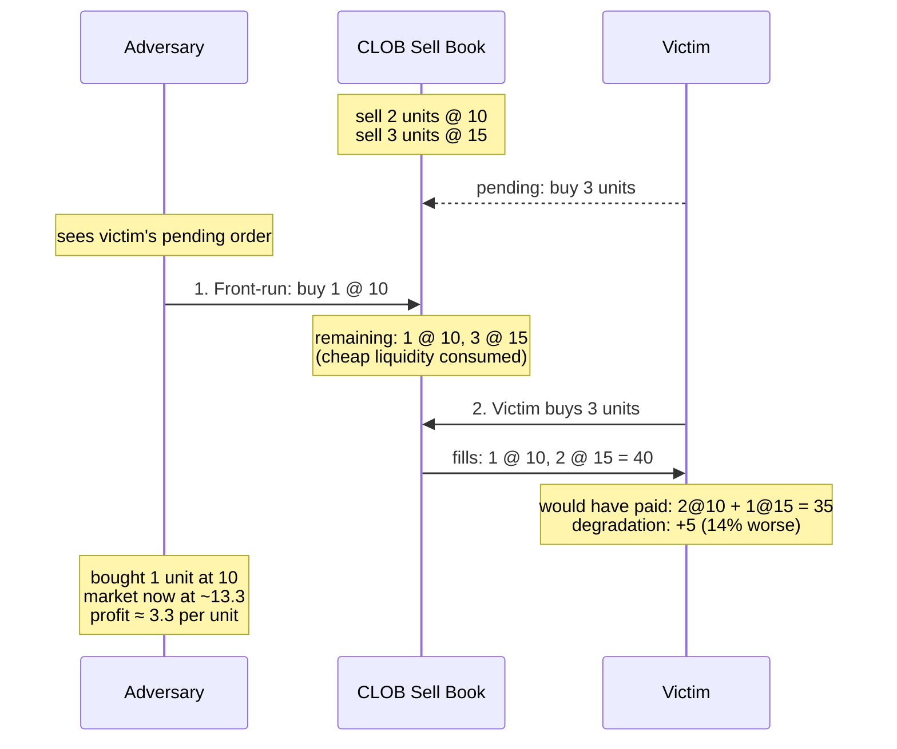

# FrontRunning

[spec](https://github.com/alfredogarcia/formal-market-mechanisms/blob/main/specs/FrontRunning.tla) · [config](https://github.com/alfredogarcia/formal-market-mechanisms/blob/main/specs/FrontRunning.cfg)

Models front-running on a CLOB — the CLOB analog of `SandwichAttack` (which targets AMMs). An adversary who controls transaction ordering consumes cheap sell-side liquidity before a victim's buy order, forcing the victim to fill at worse prices. This models HFT latency arbitrage, block builder front-running, and validator front-running in on-chain CLOBs like [dYdX](https://dydx.exchange/) and [Serum/OpenBook](https://www.openbook-solana.com/).

Both AMM sandwiching and CLOB front-running exploit ordering power, but through different mechanisms:
- **AMM sandwich**: adversary shifts the price curve with their own swap
- **CLOB front-run**: adversary depletes cheap resting orders from the book

Both are structurally impossible in `BatchedAuction`/`ZKDarkPool` due to `OrderingIndependence`.

## Verified properties

| Property | Type | Description |
|---|---|---|
| VictimFullyFilled | Invariant | Victim always gets their full order filled (enough book liquidity) |

## Attack properties (expected to fail)

Add as INVARIANT to see counterexamples:

| Property | Description |
|---|---|
| NoPriceDegradation | Victim pays no more than without front-running (FAILS: pays 40 vs 35 baseline = +14%) |
| NoAdversaryProfit | Adversary cannot profit from information advantage (FAILS: bought at 10, market at ~13.3) |
