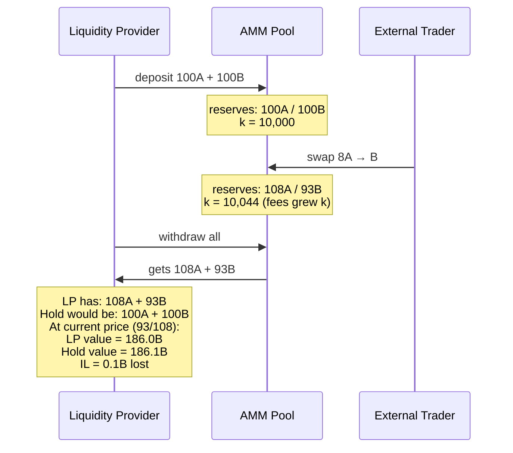

# ImpermanentLoss

[spec](https://github.com/oxarbitrage/formal-market-mechanisms/blob/main/specs/ImpermanentLoss.tla) · [config](https://github.com/oxarbitrage/formal-market-mechanisms/blob/main/specs/ImpermanentLoss.cfg)

Models the economic risk for liquidity providers (LPs) in a constant-product AMM. An LP deposits tokens into the pool, external traders swap against it (moving the price), and the LP's position is compared to simply holding the original tokens. This is the fundamental risk of providing liquidity on [Uniswap](https://docs.uniswap.org/contracts/v2/concepts/advanced-topics/understanding-returns), and why protocols offer "liquidity mining" rewards to compensate LPs.

The loss follows from the AM-GM inequality: any change in the price ratio causes the LP's position to underperform holding, even though fees grow the pool (k increases). The loss is "impermanent" because it disappears if the price returns to the original ratio — the LP keeps the fee income.

- **LP deposits**: creates the pool with initial reserves
- **External swaps**: move the price ratio, causing IL
- **Fee income**: k grows with every swap (0.3% fee), partially compensating IL
- **AM-GM inequality**: `2 * reserveA * reserveB < InitReserveA * reserveB + InitReserveB * reserveA` whenever the price ratio changes

## Verified properties (pool correctness)

| Property | Type | Description |
|---|---|---|
| PositiveReserves | Invariant | Pool reserves always > 0 |
| ConstantProductInvariant | Invariant | `reserveA * reserveB >= initial k` (fees grow k) |

## IL property (expected to fail)

Add as INVARIANT to see counterexample:

| Property | Description |
|---|---|
| NoImpermanentLoss | LP's withdrawal value >= holding value at current price (FAILS: one swap of 8A causes IL despite fee income) |
