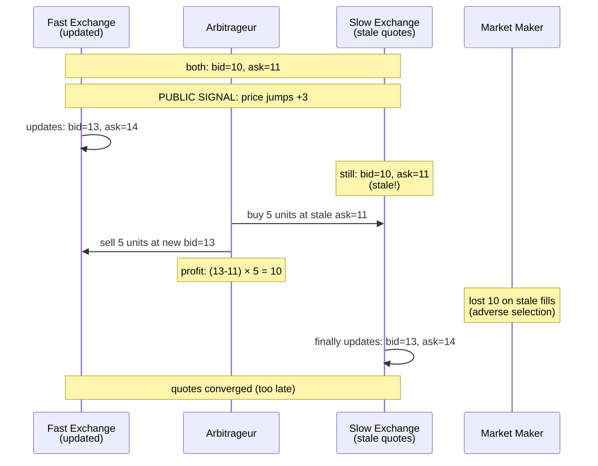

# LatencyArbitrage

[spec](https://github.com/alfredogarcia/formal-market-mechanisms/blob/main/specs/LatencyArbitrage.tla) · [config](https://github.com/alfredogarcia/formal-market-mechanisms/blob/main/specs/LatencyArbitrage.cfg)

Models latency arbitrage between two CLOBs — the core mechanism from [Budish, Cramton, and Shim (2015)](https://faculty.chicagobooth.edu/eric.budish/research/HFT-FrequentBatchAuctions.pdf). When a public signal moves the "true" price, one exchange updates faster than the other. A fast trader snipes the stale quote on the slow exchange before the market maker can update. This models the HFT arms race between NYSE and BATS/IEX, cross-exchange crypto arbitrage (Binance vs Coinbase), and cross-L2 latency (Arbitrum vs Optimism).

Budish et al.'s argument: continuous limit order books create an arms race where speed advantages translate to sniping profits. Batch auctions eliminate this because all orders in a batch get the same price — there is no stale quote to snipe. Our `BatchedAuction` spec verifies `OrderingIndependence`, confirming that submission timing cannot affect the clearing price.

- **Stale quote sniping**: fast trader exploits latency gap between exchanges
- **Zero-sum**: arbitrageur's profit exactly equals market maker's loss (verified: `ZeroSum`)
- **Quotes converge**: after the slow exchange updates, prices are aligned (verified: `QuotesConverge`)
- **Batch auction solution**: `OrderingIndependence` eliminates the concept of "stale" quotes entirely

## Verified properties

| Property | Type | Description |
|---|---|---|
| QuotesConverge | Invariant | After slow exchange updates, both exchanges have identical quotes |
| ZeroSum | Invariant | Arbitrage profit exactly equals market maker loss |

## Latency arbitrage properties (expected to fail)

Add as INVARIANT to see counterexamples:

| Property | Description |
|---|---|
| NoArbitrageProfit | No one profits from being faster (FAILS: arb profits 10 by buying at stale 11, selling at 13) |
| MarketMakerNotHarmed | Market makers not harmed by latency (FAILS: MM loses 10 on stale fills = adverse selection) |
