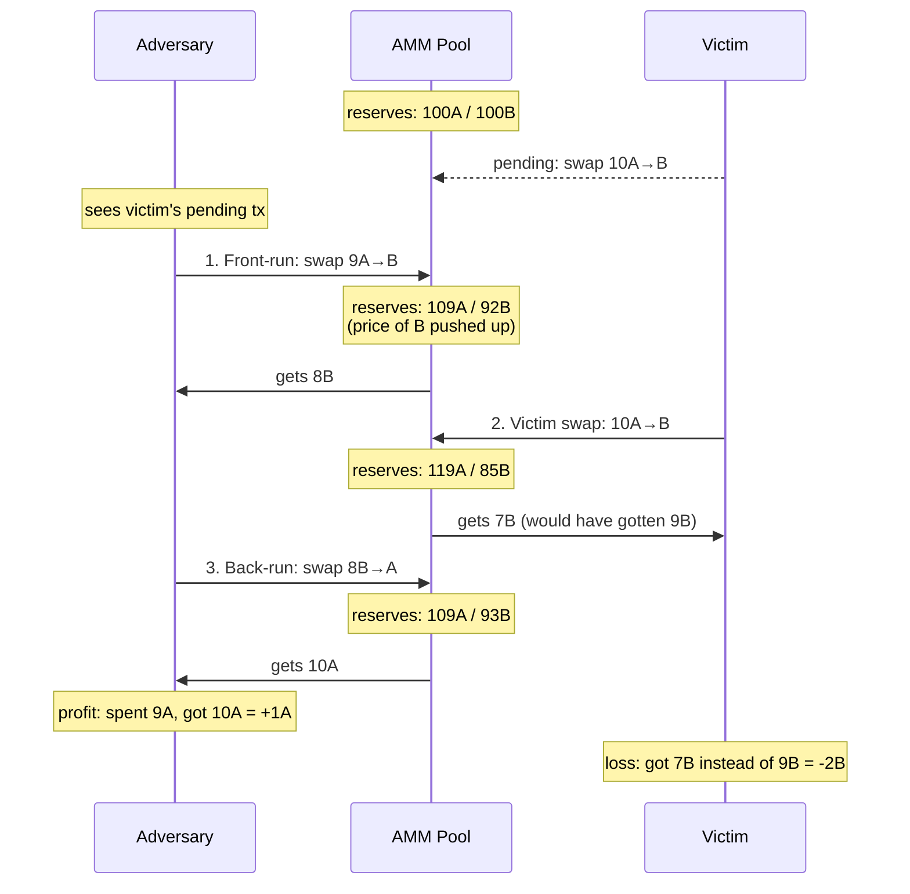

# SandwichAttack

[spec](https://github.com/alfredogarcia/formal-market-mechanisms/blob/main/specs/SandwichAttack.tla) · [config](https://github.com/alfredogarcia/formal-market-mechanisms/blob/main/specs/SandwichAttack.cfg)

Models the canonical [MEV](https://ethereum.org/en/developers/docs/mev/) (Maximal Extractable Value) attack against a constant-product AMM. An adversary who controls transaction ordering (block builder, sequencer) can extract value from other traders by sandwiching their swaps. This is the primary attack vector against AMMs like Uniswap, and the main motivation behind MEV-resistant designs like [Flashbots](https://www.flashbots.net/), [Penumbra](https://penumbra.zone/), and [CoW Protocol](https://cow.fi/).

The attack works because AMM pricing is **path-dependent**: the adversary's front-run changes the reserves, making the victim's swap execute at a worse rate. The adversary then converts back at the new favorable rate.

- **Front-run**: adversary swaps in the same direction as victim, moving the price
- **Victim swap**: executes at degraded price due to moved reserves
- **Back-run**: adversary swaps in the opposite direction, capturing the spread
- **Batch auction resistance**: `OrderingIndependence` + `UniformClearingPrice` make sandwiching impossible in BatchedAuction — there is no price to move between trades

## Verified properties (pool correctness)

| Property | Type | Description |
|---|---|---|
| PositiveReserves | Invariant | Pool reserves always > 0 through the attack |
| ConstantProductInvariant | Invariant | `reserveA * reserveB >= initial k` (fees still grow k) |

## Attack properties (expected to fail)

Add as INVARIANT to see counterexamples:

| Property | Description |
|---|---|
| NoPriceDegradation | Victim gets at least as much output as without the attack (FAILS: 7B vs 9B baseline) |
| NoAdversaryProfit | Adversary does not end up with more tokens than they started (FAILS: spent 9A, got back 10A) |
