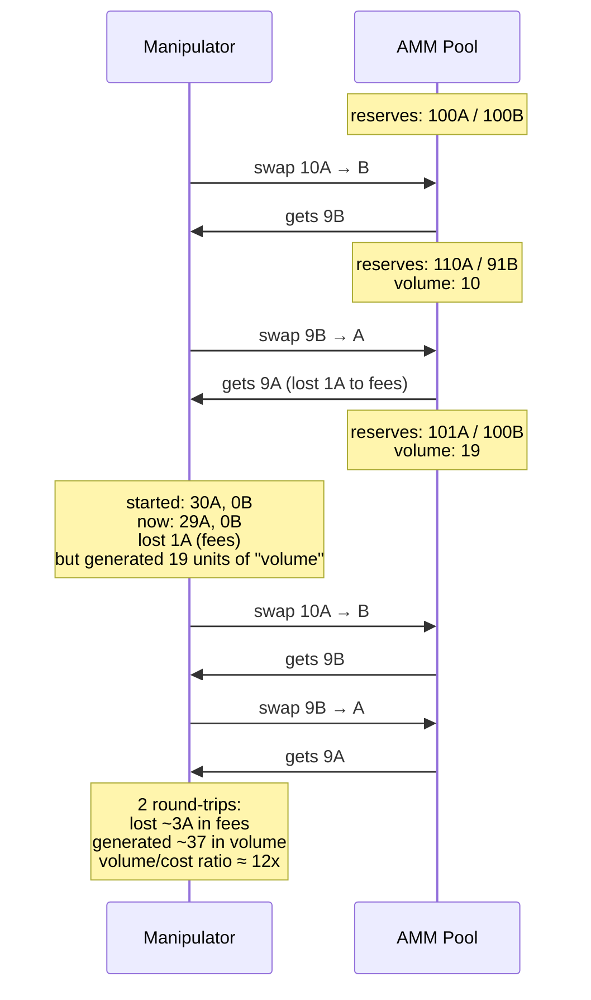

# WashTrading

[spec](https://github.com/oxarbitrage/formal-market-mechanisms/blob/main/specs/WashTrading.tla) · [config](https://github.com/oxarbitrage/formal-market-mechanisms/blob/main/specs/WashTrading.cfg)

Models wash trading on an AMM: a manipulator trades with themselves (swap A→B then B→A) to inflate reported volume. On a CLOB, self-trade prevention blocks this. On an AMM, there is no counterparty identity — any address can swap. The manipulator loses only fees, but the volume appears genuine on-chain. Estimated 40-70% of DEX volume is wash trading, used to game token listings, airdrops, and liquidity mining rewards.

- **No identity check**: AMM swaps are permissionless — anyone can trade, no STP
- **Round-trip cost**: each cycle costs fees (k grows), but cost is small relative to volume generated
- **CLOB resistance**: `NoSelfTrades` invariant in CentralizedCLOB prevents wash trading
- **Batch auction resistance**: `NoSelfTrades` in BatchedAuction/ZKDarkPool also blocks self-trades

## Verified properties (pool correctness)

| Property | Type | Description |
|---|---|---|
| PositiveReserves | Invariant | Pool reserves always > 0 |
| ConstantProductInvariant | Invariant | `reserveA * reserveB >= initial k` |

## Wash trading properties (expected to fail)

Add as INVARIANT to see counterexamples:

| Property | Description |
|---|---|
| NoWashTrading | Volume stays at 0 (FAILS: first swap generates volume immediately) |
| NoManipulatorLoss | Manipulator doesn't lose value (FAILS: 1 round-trip costs 1A in fees, 30A → 29A) |
| VolumeReflectsActivity | Volume = 0 when net position unchanged (FAILS: 19 volume units with zero net change) |
