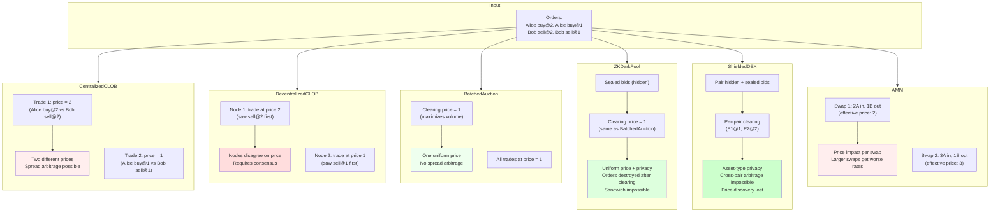

# Comparison

Same orders, different outcomes:

## Structural differences (TLC-verified)

| Property | CentralizedCLOB | DecentralizedCLOB | BatchedAuction | ZKDarkPool | ShieldedDEX | AMM |
|---|---|---|---|---|---|---|
| Uniform pricing | No | No | Yes (verified) | Yes (verified) | Yes (per-pair, verified) | No |
| Ordering independence | No (price-time priority) | No (delivery order) | Yes (verified) | Yes (verified) | Yes (per-pair, verified) | No (price impact) |
| Cross-node consensus | N/A (single node) | No (TLC counterexample) | Yes (ordering independence) | Yes (ordering independence) | Yes (per-pair) | N/A (single pool) |
| Spread arbitrage possible | Yes | Yes | No (uniform price) | No (uniform price) | No (per-pair uniform price) | Yes (price impact) |
| Front-running resistant | No (TLC counterexample) | No (ordering power) | Yes (ordering independence) | Yes (ordering independence) | Yes (pair hidden + ordering independence) | N/A (no order book) |
| Wash trading resistant | Yes (self-trade prevention) | Yes (self-trade prevention) | Yes (self-trade prevention) | Yes (self-trade prevention) | Yes (self-trade prevention) | No (no identity check) |
| Sandwich attack resistant | Trust assumption (single operator) | No (ordering power) | Yes (uniform price) | Yes (verified: SandwichResistant) | Yes (verified: per-pair + pair hidden) | No (TLC counterexample) |
| Pre-trade privacy | No | No | No | Yes (sealed bids) | Yes (sealed bids + pair hidden) | No |
| Post-trade privacy | No | No | No | Yes (verified: orders destroyed) | Yes (verified: all pairs destroyed) | No |
| Asset-type privacy | No | No | No | No (pair known) | Yes (pair hidden in commitment) | No |
| Cross-pair arbitrage | N/A | N/A | N/A | N/A | Impossible (pair hidden) | N/A |
| Always-available liquidity | No (book can be empty) | No (book can be empty) | No (batch can be empty) | No (batch can be empty) | No (batch can be empty) | Yes (verified) |
| Price improvement | Yes (verified) | Yes (per-node, verified) | Yes (verified) | Yes (verified) | Yes (per-pair, verified) | N/A (no limit prices) |
| Cross-venue arbitrage | Source venue | Source venue | Resistant (uniform price) | Resistant (uniform price + privacy) | Resistant (uniform price + full privacy) | Target venue (LP bears cost) |
| LP impermanent loss | N/A | N/A | N/A | N/A | N/A | Yes (TLC counterexample) |
| Constant product (k) | N/A | N/A | N/A | N/A | N/A | Yes (verified) |
| Conservation | Yes (verified) | Yes (per-node) | Yes (verified) | Yes (verified) | Yes (per-pair, verified) | Yes (verified) |

## Counterexamples

To see counterexamples, add these invariants to the respective `.cfg` files:

- **CLOB non-uniform pricing**: add `INVARIANT AllTradesSamePrice` to `CentralizedCLOB.cfg` (with `MaxTime = 4`, `MaxOrders = 4`)
- **AMM non-uniform pricing**: add `INVARIANT AllSwapsSamePrice` to `AMM.cfg` (with `MaxTime = 4`)
- **Decentralized CLOB divergence**: add `INVARIANT ConsensusOnTrades` (or `ConsensusOnPrices`, `ConsensusOnVolume`) to `DecentralizedCLOB.cfg`
- **Latency arbitrage**: add `INVARIANT NoArbitrageProfit` or `INVARIANT MarketMakerNotHarmed` to `LatencyArbitrage.cfg`
- **CLOB front-running**: add `INVARIANT NoPriceDegradation` or `INVARIANT NoAdversaryProfit` to `FrontRunning.cfg`
- **Wash trading**: add `INVARIANT NoWashTrading`, `INVARIANT NoManipulatorLoss`, or `INVARIANT VolumeReflectsActivity` to `WashTrading.cfg`
- **Sandwich attack**: add `INVARIANT NoPriceDegradation` or `INVARIANT NoAdversaryProfit` to `SandwichAttack.cfg`
- **Impermanent loss**: add `INVARIANT NoImpermanentLoss` to `ImpermanentLoss.cfg`
- **Cross-venue arbitrage profit**: add `INVARIANT NoArbitrageProfit` or `INVARIANT NoLPValueLoss` to `CrossVenueArbitrage.cfg`
- **Cross-pair price divergence**: add `INVARIANT CrossPairPriceConsistency` to `ShieldedDEX.cfg`
