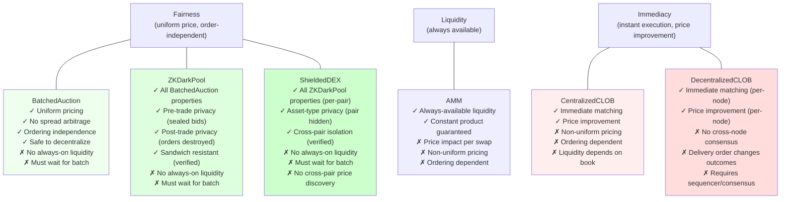

# Conclusions

The formal verification reveals a fundamental three-way trade-off between **fairness**, **liquidity**, and **immediacy**. No mechanism dominates — each one guarantees properties the others provably cannot.

## What TLC proves (not just argues)

| Conclusion | Evidence |
|---|---|
| Batched auctions eliminate spread arbitrage | `NoSpreadArbitrage` and `UniformClearingPrice` hold across all reachable states |
| Submission order cannot affect batch outcomes | `OrderingIndependence` verified — same orders in any sequence produce same clearing price |
| Batch auctions are safe to decentralize | `OrderingIndependence` means validators only need consensus on the order **set**, not sequence (Penumbra, CoW Protocol) |
| CLOBs produce different prices for the same set of orders | TLC counterexample: two trades at prices 1 and 2 from identical order set |
| Decentralizing a CLOB breaks consensus | TLC counterexample: same orders delivered in different sequence → one node executes a trade, the other executes none |
| AMM price depends on swap ordering and size | TLC counterexample: same input amounts yield different output amounts depending on reserve state |
| CLOB latency differences enable sniping profits | TLC counterexample: price jumps +3, arb buys 5 at stale ask 11 and sells at new bid 13 = profit 10; MM bears the loss (zero-sum verified) |
| Batch auctions eliminate latency arbitrage (Budish et al.) | `OrderingIndependence` means there are no stale quotes to snipe — all orders clear at the same price regardless of timing |
| CLOBs are vulnerable to front-running | TLC counterexample: adversary buys 1 unit at 10, victim pays 40 instead of 35 (14% degradation); adversary profits from buying below market |
| AMMs are vulnerable to wash trading | TLC counterexample: 1 round-trip generates 19 units of volume at cost of 1A in fees; no identity check to prevent self-trading |
| AMMs are vulnerable to sandwich attacks | TLC counterexample: adversary extracts 1A profit while victim loses 2B (22% worse output) |
| Batch auctions resist sandwich attacks | `OrderingIndependence` + `UniformClearingPrice` — no price to move between trades |
| AMM LPs face impermanent loss from any price movement | TLC counterexample: single swap of 8A causes IL despite fees growing k from 10,000 to 10,044 |
| Cross-venue arbitrage profits at LP's expense | TLC counterexample: arb buys A on CLOB for 5B, sells on AMM for 9B; LP bears the IL. Price converges (verified: `PriceNotDiverging`) |
| ZK dark pools inherit all batch auction guarantees | `UniformClearingPrice`, `OrderingIndependence`, `NoSpreadArbitrage` all verified for ZKDarkPool (same clearing logic) |
| Sealed bids + uniform price makes sandwich attacks provably impossible | `SandwichResistant` verified: any trader with both buy and sell fills gets the same price on both sides — zero profit from sandwich pattern |
| Post-trade privacy is structurally enforced | `PostTradeOrdersDestroyed` verified: after clearing, `buyOrders = <<>>` and `sellOrders = <<>>` — individual orders are destroyed, only clearing price + fills retained |
| ZKDarkPool is a formal refinement of BatchedAuction | All 6 BatchedAuction invariants pass on ZKDarkPool's state space via INSTANCE variable mapping (ZKRefinement.tla) — privacy is a pure addition, not a mechanism change |
| ShieldedDEX inherits all ZKDarkPool guarantees per pair | `PerPairUniformPrice`, `PerPairPriceImprovement`, `PerPairNoSelfTrades`, `PerPairSandwichResistant` all verified across 48,065 states |
| Cross-pair isolation holds — each pair clears independently | `CrossPairIsolation` verified: each pair's trades use only that pair's clearing price, no cross-pair information leakage |
| Asset-type privacy prevents cross-pair arbitrage | `CrossPairPriceConsistency` fails: P1 clears at 1, P2 clears at 2 with no mechanism to align — this is the price discovery cost of privacy |
| Privacy adds a 4th dimension, does not fix the impossibility triangle | `NoImmediacy` verified: during commit phase, no trades exist in any pair — you still must wait for the batch |
| AMM liquidity never runs out | `PositiveReserves` + `PositiveSwapOutput` hold in all states — swaps always succeed |
| All mechanisms conserve assets (per-node) | `ConservationOfAssets` / `ConservationOfTokens` verified for each mechanism |

## Vulnerability resistance summary (TLC-verified)

| Attack | CentralizedCLOB | DecentralizedCLOB | BatchedAuction | ZKDarkPool | ShieldedDEX | AMM |
|---|---|---|---|---|---|---|
| Front-running | Vulnerable | Vulnerable | **Resistant** | **Resistant** | **Resistant** | N/A |
| Sandwich attack | Trust assumption | Vulnerable | **Resistant** | **Resistant** | **Resistant** | Vulnerable |
| Latency arbitrage | Vulnerable | Vulnerable | **Resistant** | **Resistant** | **Resistant** | N/A |
| Wash trading | Resistant | Resistant | Resistant | Resistant | Resistant | Vulnerable |
| Spread arbitrage | Vulnerable | Vulnerable | **Resistant** | **Resistant** | **Resistant** | Vulnerable |
| Asset-targeted attack | Vulnerable | Vulnerable | Vulnerable | Vulnerable | **Resistant** | Vulnerable |
| Cross-pair info leakage | N/A | N/A | N/A | Yes (pair known) | **None** (verified) | N/A |
| **Attacks resisted** | **1/6** | **1/6** | **5/6** | **5/6** | **6/6** | **1/6** |

ShieldedDEX is the only mechanism that resists all six attack categories. It inherits batch auction resistance to front-running, sandwich, latency arbitrage, spread arbitrage, and wash trading — and adds resistance to asset-targeted attacks because the pair itself is hidden. The cost: cross-pair price discovery is lost.

## ShieldedDEX: strongest privacy, least vulnerable clearing

ShieldedDEX combines the strongest privacy guarantees (order contents + asset pair hidden — strictly more than any other mechanism, as shown in the [observer visibility table](mechanisms/shielded-dex.md#observer-information-visibility)) with the least vulnerable clearing mechanism (batch auction — formally verified to resist front-running, sandwich attacks, spread arbitrage, and latency arbitrage). Its ordering independence makes it safe to decentralize without a sequencer: validators only need consensus on the commitment **set**, not the sequence, and they never see the contents or target pairs. The cost is immediacy and cross-pair price discovery — structural tradeoffs that no amount of privacy can eliminate.

## The impossibility triangle

A mechanism that clears at a uniform price (fairness) must collect orders before clearing, sacrificing immediacy. A mechanism that always has liquidity (AMM) must price algorithmically, creating price impact that depends on ordering. A mechanism that matches immediately (CLOB) exposes different prices to different participants, enabling spread arbitrage. These are structural constraints, not implementation choices — they follow from the definitions of the mechanisms themselves.

## Privacy as MEV resistance

The ZKDarkPool spec demonstrates that adding privacy (sealed bids + post-trade order destruction) to a batch auction doesn't change any correctness property — all `BatchedAuction` invariants carry over — but adds a new dimension: MEV elimination through information hiding. The `SandwichResistant` invariant proves that the sandwich attack pattern (which succeeds against AMMs in `SandwichAttack.tla`) is structurally impossible when orders are sealed and cleared at a uniform price. Privacy is not just a feature — it's a mechanism design tool that eliminates the information asymmetry attackers need.

## Privacy vs price discovery (the 4th dimension)

The ShieldedDEX spec extends the impossibility triangle into a tetrahedron. Hiding the asset pair in addition to order contents (inspired by Zcash Shielded Assets, ZIP-226/227) eliminates asset-targeted attacks — an attacker cannot even identify which pair to sandwich. But full privacy has a cost: cross-pair arbitrage becomes impossible within the batch because no participant can observe price divergence across pairs. TLC proves this concretely: P1 clears at 1, P2 clears at 2, and no mechanism exists to align them. The tradeoff is not fairness vs liquidity vs immediacy, but fairness vs liquidity vs immediacy vs price discovery — and no mechanism achieves all four.

## Centralization vs decentralization

The DecentralizedCLOB spec shows that continuous matching is fundamentally order-dependent — decentralizing it without consensus on transaction ordering leads to divergent state across nodes. This is why real-world decentralized CLOBs (dYdX v4, Hyperliquid) run their own chains with a single sequencer or validator-based consensus to impose a total order. Batched auctions avoid this problem entirely because clearing is order-independent.
