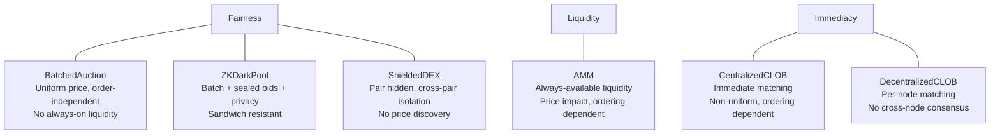

# Conclusions

The formal verification reveals a fundamental three-way trade-off between **fairness**, **liquidity**, and **immediacy**. No mechanism dominates — each one guarantees properties the others provably cannot.

## What TLC proves (not just argues)

| Conclusion | Evidence |
|---|---|
| Batch auctions are safe to decentralize; CLOBs are not | `OrderingIndependence` verified for batches; TLC counterexample shows CLOB divergence across nodes |
| Sealed bids + uniform price eliminates sandwich attacks | `SandwichResistant` verified: same price on both sides of any sandwich pattern → zero profit |
| ZKDarkPool is a formal refinement of BatchedAuction | All 6 BatchedAuction invariants pass on ZKDarkPool's state space (ZKRefinement.tla) — privacy is a pure addition |
| ShieldedDEX resists all 6 attack categories (unique) | `PerPairSandwichResistant`, `CrossPairIsolation` verified across 48,065 states; pair hidden prevents asset-targeted attacks |
| Privacy does NOT fix the impossibility triangle | `NoImmediacy` verified + `CrossPairPriceConsistency` fails (P1@1, P2@2) — adds a 4th dimension (price discovery) instead |
| AMM liquidity is always available but exploitable | `PositiveReserves` holds in all states; but sandwich, wash trading, and impermanent loss counterexamples all found |

## Vulnerability resistance summary (TLC-verified)

| Attack | CentralizedCLOB | DecentralizedCLOB | BatchedAuction | ZKDarkPool | ShieldedDEX | AMM |
|---|---|---|---|---|---|---|
| Front-running | Vulnerable | Vulnerable | **Resistant** | **Resistant** | **Resistant** | N/A |
| Sandwich attack | Trust assumption | Vulnerable | **Resistant** | **Resistant** | **Resistant** | Vulnerable |
| Latency arbitrage | Vulnerable | Vulnerable | **Resistant** | **Resistant** | **Resistant** | N/A |
| Wash trading | Resistant | Resistant | Resistant | Resistant | Resistant | Vulnerable |
| Spread arbitrage | Vulnerable | Vulnerable | **Resistant** | **Resistant** | **Resistant** | Vulnerable |
| Asset-targeted attack | Vulnerable | Vulnerable | Vulnerable | Vulnerable | **Resistant** | Vulnerable |
| Cross-pair info leakage | N/A | N/A | N/A | Yes (pair known) | **None** (verified) | N/A |
| **Attacks resisted** | **1/6** | **1/6** | **5/6** | **5/6** | **6/6** | **1/6** |

ShieldedDEX is the only mechanism that resists all six attack categories. It inherits batch auction resistance to front-running, sandwich, latency arbitrage, spread arbitrage, and wash trading — and adds resistance to asset-targeted attacks because the pair itself is hidden. The cost: cross-pair price discovery is lost.

## ShieldedDEX: strongest privacy, least vulnerable clearing

ShieldedDEX combines the strongest privacy guarantees (order contents + asset pair hidden — strictly more than any other mechanism, as shown in the [observer visibility table](mechanisms/shielded-dex.md#observer-information-visibility)) with the least vulnerable clearing mechanism (batch auction — formally verified to resist front-running, sandwich attacks, spread arbitrage, and latency arbitrage). Its ordering independence makes it safe to decentralize without a sequencer: validators only need consensus on the commitment **set**, not the sequence, and they never see the contents or target pairs. The cost is immediacy and cross-pair price discovery — structural tradeoffs that no amount of privacy can eliminate.

## The impossibility triangle

A mechanism that clears at a uniform price (fairness) must collect orders before clearing, sacrificing immediacy. A mechanism that always has liquidity (AMM) must price algorithmically, creating price impact that depends on ordering. A mechanism that matches immediately (CLOB) exposes different prices to different participants, enabling spread arbitrage. These are structural constraints, not implementation choices — they follow from the definitions of the mechanisms themselves.

## Privacy as MEV resistance

The ZKDarkPool spec demonstrates that adding privacy (sealed bids + post-trade order destruction) to a batch auction doesn't change any correctness property — all `BatchedAuction` invariants carry over — but adds a new dimension: MEV elimination through information hiding. The `SandwichResistant` invariant proves that the sandwich attack pattern (which succeeds against AMMs in `SandwichAttack.tla`) is structurally impossible when orders are sealed and cleared at a uniform price. Privacy is not just a feature — it's a mechanism design tool that eliminates the information asymmetry attackers need.

## Privacy vs price discovery (the 4th dimension)

The ShieldedDEX spec extends the impossibility triangle into a tetrahedron. Hiding the asset pair in addition to order contents (inspired by Zcash Shielded Assets, ZIP-226/227) eliminates asset-targeted attacks — an attacker cannot even identify which pair to sandwich. But full privacy has a cost: cross-pair arbitrage becomes impossible within the batch because no participant can observe price divergence across pairs. TLC proves this concretely: P1 clears at 1, P2 clears at 2, and no mechanism exists to align them. The tradeoff is not fairness vs liquidity vs immediacy, but fairness vs liquidity vs immediacy vs price discovery — and no mechanism achieves all four.

## Centralization vs decentralization

The DecentralizedCLOB spec shows that continuous matching is fundamentally order-dependent — decentralizing it without consensus on transaction ordering leads to divergent state across nodes. This is why real-world decentralized CLOBs (dYdX v4, Hyperliquid) run their own chains with a single sequencer or validator-based consensus to impose a total order. Batched auctions avoid this problem entirely because clearing is order-independent.
