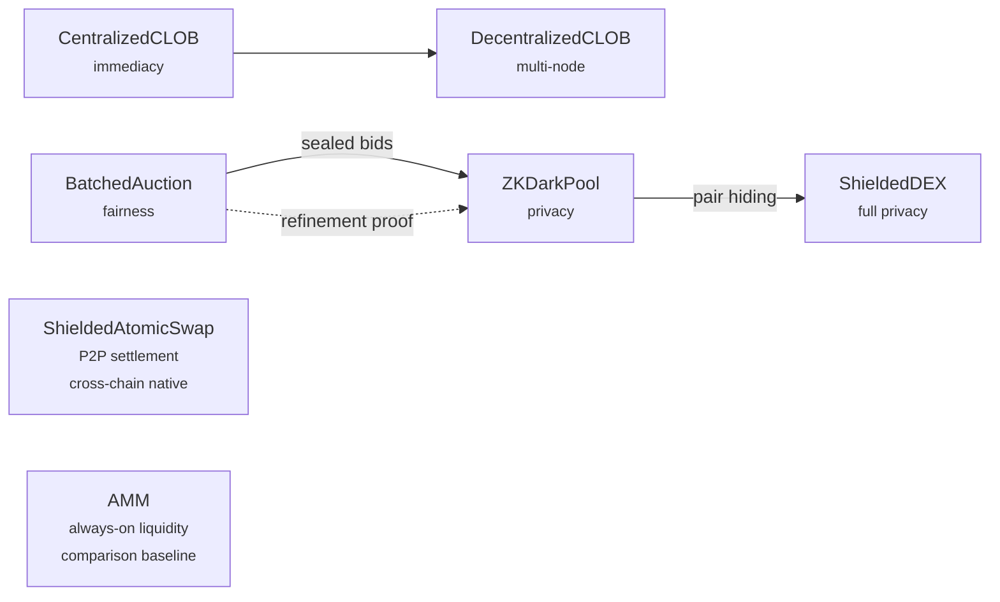

# Formal Market Mechanisms

A collection of TLA+ specifications that formally verify and compare market mechanisms (CLOBs, batch auctions, AMMs, and privacy-preserving dark pools) across correctness, fairness, MEV resistance, and decentralizability.

**7 mechanism specs:** CentralizedCLOB · BatchedAuction · AMM · ZKDarkPool · ShieldedDEX · ShieldedAtomicSwap · DecentralizedCLOB

**7 attack/economic/proof specs:** SandwichAttack · FrontRunning · LatencyArbitrage · WashTrading · ImpermanentLoss · CrossVenueArbitrage · ZKRefinement

All results are TLC-verified — not just argued. See the [Conclusions](conclusions.md) chapter for the full summary of findings.

For an accessible introduction to why this matters, read the [blog post](https://github.com/oxarbitrage/formal-market-mechanisms/blob/main/blog.md).
