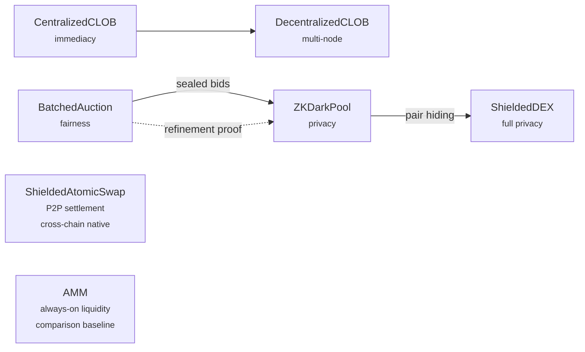

# Formal Market Mechanisms

A collection of TLA+ specifications that formally verify and compare market mechanisms (CLOBs, batch auctions, AMMs, and privacy-preserving dark pools) across correctness, fairness, MEV resistance, and decentralizability.

**Key results (all TLC-verified, not just argued):**
- An **impossibility triangle** between fairness, liquidity, and immediacy — no mechanism can provide all three
- Batch auctions are **safe to decentralize** (OrderingIndependence); CLOBs are not (TLC counterexample: same orders → different trades at different nodes)
- Sandwich attacks, front-running, and latency arbitrage are **structurally impossible** in batch auctions — formally verified, not just claimed
- Privacy (sealed bids + order destruction) is a **mechanism design tool** for MEV elimination, proven equivalent to batch clearing via refinement mapping
- Asset-type privacy (ShieldedDEX) adds a **4th dimension** to the impossibility triangle — privacy vs price discovery — but does NOT fix the original three-way tradeoff
- AMMs provide **always-available liquidity** but are vulnerable to sandwich attacks, wash trading, and impermanent loss — all with TLC counterexamples

**7 mechanism specs:** CentralizedCLOB · BatchedAuction · AMM · ZKDarkPool · ShieldedDEX · ShieldedAtomicSwap · DecentralizedCLOB

**7 attack/economic/proof specs:** SandwichAttack · FrontRunning · LatencyArbitrage · WashTrading · ImpermanentLoss · CrossVenueArbitrage · ZKRefinement
