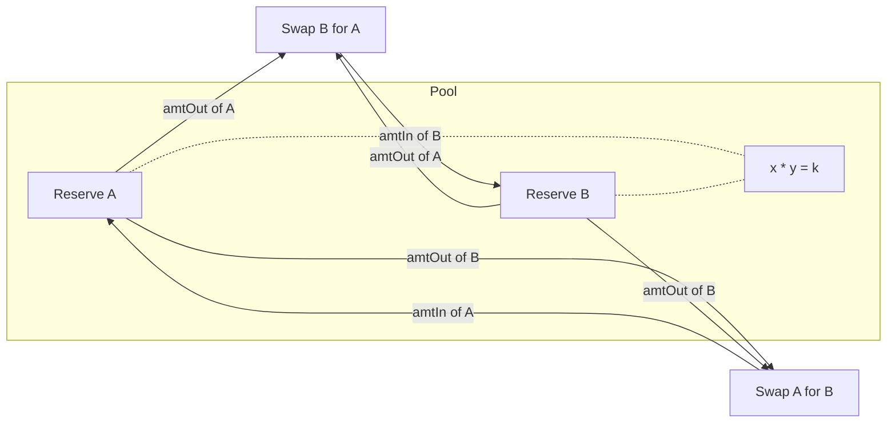

# AMM (Automated Market Maker)

[spec](https://github.com/alfredogarcia/formal-market-mechanisms/blob/main/specs/AMM.tla) · [config](https://github.com/alfredogarcia/formal-market-mechanisms/blob/main/specs/AMM.cfg)

A constant-product market maker (x*y=k). No order book — traders swap against a liquidity pool. Price is determined by the reserve ratio, not by matching orders. This models [Uniswap v2](https://docs.uniswap.org/contracts/v2/overview) and its forks (SushiSwap, PancakeSwap). Related designs include [Curve](https://curve.fi/) (StableSwap invariant) and [Balancer](https://balancer.fi/) (generalized weighted pools).

Traders swap tokens against the pool. The output amount is computed from the constant-product formula: `amtOut = reserveY * amtIn / (reserveX + amtIn)` (minus fees). Larger swaps get worse prices (price impact). The pool always has liquidity — swaps never fail due to an empty book.

- **Constant product**: `reserveA * reserveB >= k` (k grows from fees)
- **Price impact**: larger swaps move the price more, getting worse effective rates
- **Fees**: configurable (default 0.3%), accrue to the pool reserves
- **No order book**: price is a function of reserves, not supply/demand matching

## Verified properties

| Property | Type | Description |
|---|---|---|
| ConstantProductInvariant | Invariant | `reserveA * reserveB >= initial k` (never decreases) |
| PositiveReserves | Invariant | Pool reserves are always > 0 |
| PositiveSwapOutput | Invariant | Every swap produces output > 0 |
| ConservationOfTokens | Invariant | Total tokens in system (pool + all traders) is constant |
