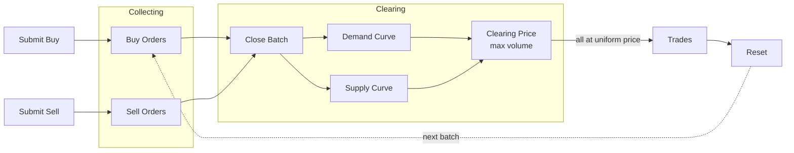

# BatchedAuction

[spec](https://github.com/alfredogarcia/formal-market-mechanisms/blob/main/specs/BatchedAuction.tla) · [config](https://github.com/alfredogarcia/formal-market-mechanisms/blob/main/specs/BatchedAuction.cfg)

A periodic auction that collects orders over a batch window, then clears all at a single uniform price that maximizes traded volume. This models systems like [Penumbra](https://penumbra.zone/) (sealed-bid batch auctions with privacy on Cosmos), [CoW Protocol](https://cow.fi/) (batch auctions for MEV protection), and NYSE/NASDAQ opening/closing auctions. The academic foundation is Budish, Cramton, and Shim's "[The High-Frequency Trading Arms Race](https://faculty.chicagobooth.edu/eric.budish/research/HFT-FrequentBatchAuctions.pdf)" (2015), which proposes frequent batch auctions to eliminate the latency arms race.

Because `OrderingIndependence` is verified, batch auctions are safe to decentralize — validators only need to agree on the **set** of orders, not their **sequence**. This is why Penumbra and CoW Protocol can run batch auctions across distributed validators without the consensus problems that plague decentralized CLOBs.

Orders accumulate during the **collection phase** without matching. When the batch closes, a single **clearing price** is computed that maximizes traded volume. All trades execute at this uniform price — no spread to capture.

- **Collection phase**: orders accumulate without matching
- **Clearing phase**: compute clearing price from aggregate supply/demand curves, fill eligible orders at the uniform price
- **Self-trade prevention**: buyer-seller pairs with the same trader are skipped during clearing

## Verified properties

| Property | Type | Description |
|---|---|---|
| UniformClearingPrice | Invariant | All trades in a batch execute at the same price |
| PriceImprovement | Invariant | Trade price <= buyer's limit and >= seller's limit |
| PositiveTradeQuantities | Invariant | Every trade has quantity > 0 |
| NoSelfTrades | Invariant | No trade has the same buyer and seller |
| OrderingIndependence | Invariant | Clearing result matches the deterministic clearing price regardless of submission order |
| NoSpreadArbitrage | Invariant | No price difference to exploit within a batch |
| EventualClearing | Liveness | Every batch eventually clears |
