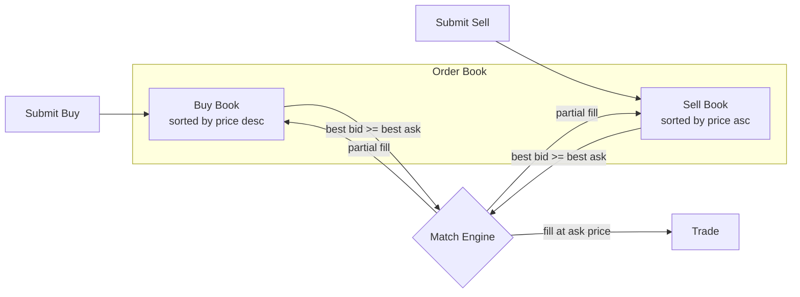

# CentralizedCLOB

[spec](https://github.com/oxarbitrage/formal-market-mechanisms/blob/main/specs/CentralizedCLOB.tla) · [config](https://github.com/oxarbitrage/formal-market-mechanisms/blob/main/specs/CentralizedCLOB.cfg)

A continuous limit order book with a single matching engine. Orders are matched immediately using price-time priority. This models traditional exchanges like NYSE, NASDAQ, and centralized crypto exchanges (Binance, Coinbase).

Each order is matched **immediately** on arrival. The trade executes at the resting order's price. Different trades can execute at different prices (enabling spread arbitrage).

- **Matching**: best bid vs best ask, executes at the ask (resting order) price
- **Partial fills**: smaller side is fully filled, larger side's quantity is reduced
- **Self-trade prevention**: a trader cannot match against themselves

## Verified properties

| Property | Type | Description |
|---|---|---|
| PositiveBookQuantities | Invariant | Every resting order has quantity > 0 |
| PositiveTradeQuantities | Invariant | Every trade has quantity > 0 |
| PriceImprovement | Invariant | Trade price <= buyer's limit and >= seller's limit |
| NoSelfTrades | Invariant | No trade has the same buyer and seller |
| UniqueOrderIds | Invariant | All order IDs on the books are distinct |
| ConservationOfAssets | Invariant | Trade log is consistent across traders |
| EventualMatching | Liveness | Crossed books between different traders are eventually resolved |
