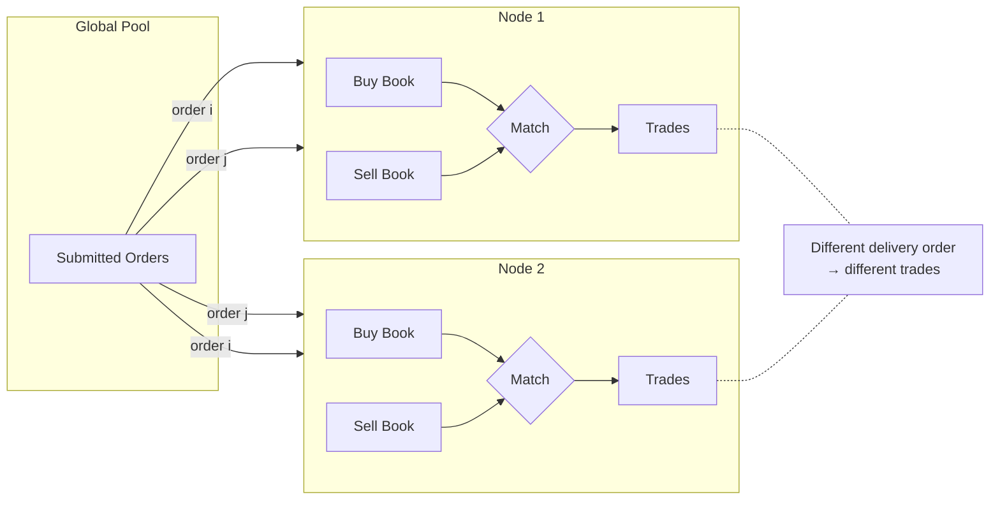

# DecentralizedCLOB

[spec](https://github.com/oxarbitrage/formal-market-mechanisms/blob/main/specs/DecentralizedCLOB.tla) · [config](https://github.com/oxarbitrage/formal-market-mechanisms/blob/main/specs/DecentralizedCLOB.cfg)

Multiple nodes each maintain independent order books. Orders are submitted to a global pool and delivered to nodes in nondeterministic order — modeling network propagation delay. Each node runs the same price-time priority matching engine as `CentralizedCLOB`. This models on-chain order books like [Serum/OpenBook](https://solanacompass.com/projects/openbook) (Solana, historical), [dYdX v4](https://dydx.exchange/) (Cosmos app-chain where validators run matching), [Hyperliquid](https://hyperliquid.xyz/) (L1 with on-chain order book), and [Injective](https://injective.com/) (Cosmos chain).

The core problem: without consensus on ordering, different nodes process the same orders in different sequences and **arrive at different results**. TLC proves this is not just a theoretical concern — it finds concrete traces where the same set of orders produces different trades (or no trades at all) at different nodes.

- **Per-node matching**: same CLOB logic (price-time priority, ask price execution)
- **Nondeterministic delivery**: any node can receive any unprocessed order next
- **Self-trade interaction**: delivery order determines which orders get priority, and self-trade prevention can block matches that would succeed in a different sequence

## Verified properties (per-node correctness)

| Property | Type | Description |
|---|---|---|
| PositiveBookQuantities | Invariant | Every resting order on every node has quantity > 0 |
| PositiveTradeQuantities | Invariant | Every trade at every node has quantity > 0 |
| PriceImprovement | Invariant | Price improvement holds at every node |
| NoSelfTrades | Invariant | No self-trades at any node |

## Consensus properties (expected to fail)

Add as INVARIANT to see counterexamples:

| Property | Description |
|---|---|
| ConsensusOnTrades | After all orders delivered and matched, all nodes have identical trade logs |
| ConsensusOnPrices | All nodes agree on the set of trade prices |
| ConsensusOnVolume | All nodes agree on the number of trades |
