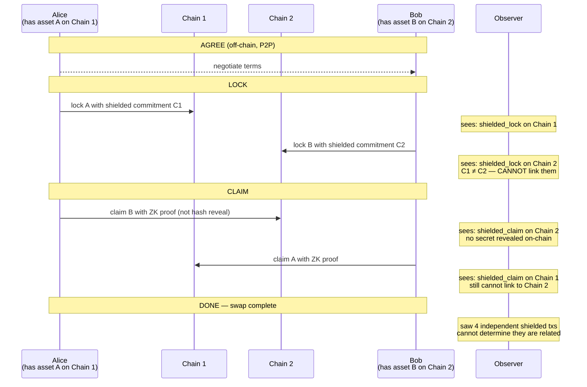

# ShieldedAtomicSwap

[spec](https://github.com/oxarbitrage/formal-market-mechanisms/blob/main/specs/ShieldedAtomicSwap.tla) · [config](https://github.com/oxarbitrage/formal-market-mechanisms/blob/main/specs/ShieldedAtomicSwap.cfg)

A shielded atomic swap: P2P cross-chain settlement with **unlinkability**. Standard HTLCs have a known privacy flaw — the same hash H appears on both chains, allowing an observer to link the two legs of the swap. Even on privacy chains like Zcash, the HTLC hash pattern leaks cross-chain linkage.

ShieldedAtomicSwap replaces the hash reveal with a ZK proof of preimage knowledge. Each leg uses a **different commitment** on-chain, but the ZK proof guarantees they correspond to the same secret. An observer sees two independent shielded transactions — unlinkable.

## How it differs from ShieldedDEX

| | ShieldedDEX | ShieldedAtomicSwap |
|---|---|---|
| **Use case** | Exchange (many-to-many) | Settlement (one-to-one) |
| **Participants** | Many traders, batched | Two counterparties |
| **Price discovery** | Batch clearing finds price | Price negotiated bilaterally |
| **Coordinator** | Batch coordinator needed | None — fully P2P |
| **Latency** | Must wait for batch | Immediate (when both online) |
| **Cross-chain** | Single chain/shielded pool | **Cross-chain native** |
| **Zcash changes** | Matching engine (new ZIP) | HTLC in shielded pool (new ZIP) |

## Use cases

ShieldedAtomicSwap is not an exchange — it's **private settlement** between two parties who already agreed on terms. It trades price discovery for trustless cross-chain execution without linkability.

**Where ShieldedAtomicSwap wins:**

- **Cross-chain swaps without bridges** — bridges are the #1 hack target in crypto. Atomic swaps eliminate the bridge entirely — no custodian, no multisig, no wrapped tokens. Each party locks on their own chain and claims with a ZK proof.
- **OTC trades between known counterparties** — two parties who already agreed on a price (e.g., institutional OTC, treasury-to-treasury). They don't need price discovery — they need private, trustless settlement.
- **Privacy-preserving cross-chain migration** — moving value from one chain to another without leaving a linkable trail. Standard HTLCs leak the link via the shared hash. Shielded swaps break that link.
- **Small P2P trades** — no minimum batch size, no liquidity pool needed, no fees beyond gas. Two people can swap any amount directly.

**Where other mechanisms are better:**

| Need | Better choice | Why |
|---|---|---|
| Price discovery | ShieldedDEX or AMM | Atomic swap price is whatever you negotiate |
| Many counterparties | ShieldedDEX | Atomic swap is strictly 1-to-1 |
| No liveness requirement | ShieldedDEX | Bob must be online to claim |
| Single-chain trading | AMM or ShieldedDEX | Atomic swap is designed for cross-chain |

## Protocol

## Standard HTLC vs Shielded

| Property | Standard HTLC | ShieldedAtomicSwap |
|---|---|---|
| Hash visible on-chain | **Yes** (same H on both chains) | **No** (ZK proof, nothing revealed) |
| Cross-chain linkable | **Yes** (match by H) | **No** (different commitments) |
| Amounts visible | Yes (or partially hidden) | **No** (shielded) |
| Asset types visible | Yes | **No** (ZSA) |
| Atomic settlement | Yes | Yes (verified) |
| Timeout refund | Yes | Yes (verified) |

## Zcash protocol changes needed

| Component | What's needed | Status |
|---|---|---|
| Shielded custom tokens | ZIP-226 (issuance), ZIP-227 (transfer) | Specified, not yet activated |
| Shielded time-locks | Locking UTXOs in shielded pool with time conditions | **Does not exist** |
| ZK-contingent claims | Proving preimage knowledge without revealing hash | **Does not exist** |
| Cross-chain relay | Verifying events on other chains | **Does not exist** |

## Verified properties (32 states)

| Property | Type | Description |
|---|---|---|
| AtomicSettlement | Invariant | Both legs execute, both refund, or Alice claims + Bob offline (3 terminal states, no partial loss without liveness failure) |
| NoCounterpartyRisk | Invariant | TimeoutA > TimeoutB ensures Bob's claim window is open whenever Alice can claim |
| ConservationA | Invariant | Total asset A preserved across all states |
| ConservationB | Invariant | Total asset B preserved across all states |
| Unlinkability | Invariant | Observer sees different values on each chain — cannot link the two legs |
| SecretNeverRevealed | Invariant | Observer never sees the secret — only opaque shielded commitments, claims, and refunds |
| NoCoordinator | Invariant | Protocol has only two participants, no matching engine/pool/batch |

## Properties expected to fail

Add as INVARIANT to see counterexamples:

| Property | Description |
|---|---|
| NoPriceDiscovery | The exchange rate is whatever Alice and Bob agreed — no market mechanism to ensure fairness (FAILS: AmountA ≠ AmountB with nothing to prevent it) |
| NoWaitingRequired | Alice must wait for TimeoutA if Bob disappears (FAILS: liveness vs safety tradeoff) |
| BobCanLose | If Bob goes offline after Alice claims, Alice gets both assets (FAILS: Alice claims B, timeout refunds A → Alice has 10A + 5B) |
| StandardHTLCWouldBeLinked | Standard HTLCs use the same hash on both chains (FAILS in our shielded model: commitments are always different) |

## The liveness vs safety tradeoff

The `BobCanLose` counterexample reveals a fundamental tradeoff in atomic swaps:
- **Safety** (timeouts) requires **liveness** (both parties online)
- If Bob goes offline after Alice claims, Alice gets both assets
- This is not a bug — it's the structural cost of no coordinator
- ShieldedDEX doesn't have this problem (batch coordinator ensures both sides clear)

This is a new dimension in the impossibility space: **P2P settlement requires mutual liveness**.
