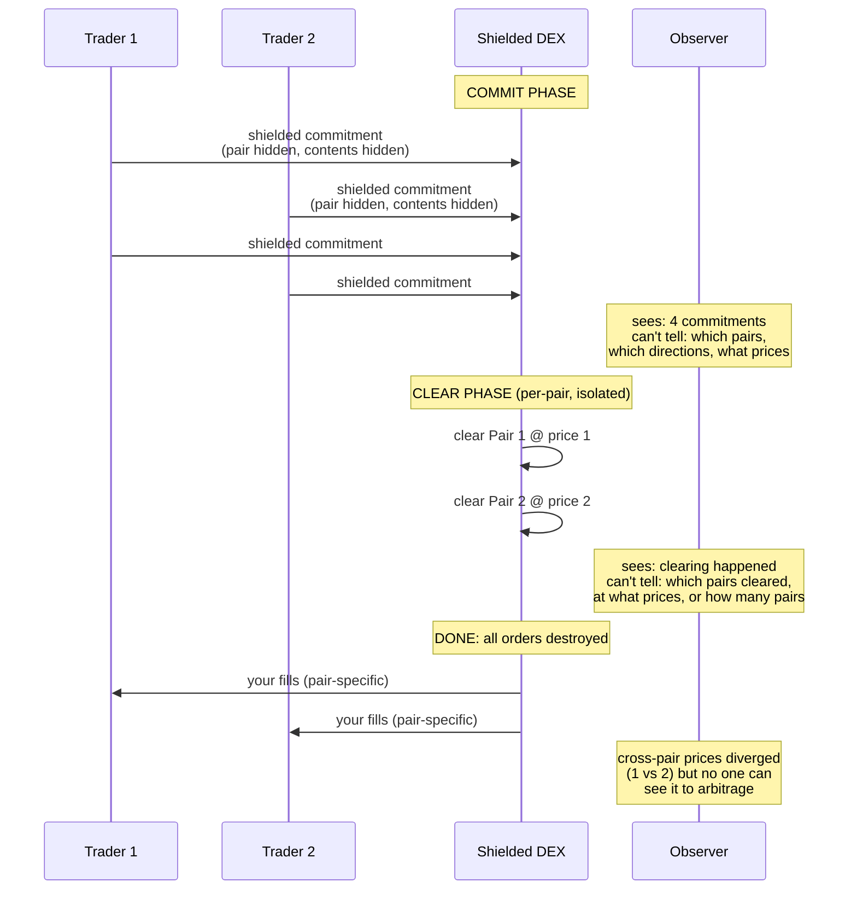

# ShieldedDEX

<sub>[spec](https://github.com/oxarbitrage/formal-market-mechanisms/blob/main/specs/ShieldedDEX.tla) · [config](https://github.com/oxarbitrage/formal-market-mechanisms/blob/main/specs/ShieldedDEX.cfg)</sub>

A multi-asset shielded exchange where even the **asset pair** is hidden — not just order contents. Inspired by [Zcash Shielded Assets (ZIP-226/227)](https://zips.z.cash/zip-0227): custom tokens issued within the shielded pool inherit Zcash's privacy guarantees, making transfers of different asset types indistinguishable on-chain. Also related to [Penumbra](https://penumbra.zone/)'s multi-asset shielded pools and [Anoma](https://anoma.net/)'s intent-centric privacy architecture.

This is a **genuinely new mechanism type**, not a formalization of an existing design. It extends `ZKDarkPool` from single-pair to multi-pair with asset-type privacy.

## Implementation status

Zcash's ZSA ZIPs (226/227) define how to issue and transfer custom tokens privately, but **no matching engine exists** in the Zcash protocol. A ShieldedDEX would require additional protocol work:

| Component | What's needed | Status |
|---|---|---|
| Shielded custom tokens | ZIP-226 (issuance), ZIP-227 (transfer) | Specified, not yet activated |
| Order commitment tx type | New transaction type or memo-field protocol for submitting shielded orders | **Does not exist** |
| Batch clearing logic | Consensus-layer rule (new ZIP) or smart contract for clearing batches | **Does not exist** |
| ZK proof of valid order | Prover circuit: order is well-formed without revealing contents or pair | **Does not exist** |
| Clearing verification | Validators verify correct batch execution via ZK proof | **Does not exist** |

Possible paths to implementation:
- **Consensus-layer ZIP** — new transaction types for order commitments + consensus rule for batch clearing. Most secure, hardest to deploy.
- **Layer 2 / sidechain** — batch clearing off-chain, settlement on Zcash via shielded transfers. Easier to deploy, weaker trust assumptions.
- **Smart contract layer** — if Zcash gains programmability, ShieldedDEX could be a contract on the shielded pool.

## How ShieldedDEX differs from existing systems

| Property | Penumbra | Anoma | ShieldedDEX (this work) |
|---|---|---|---|
| Asset pair hidden | No (public markets) | Partial (solver sees) | **Yes** |
| Matching method | Deterministic batch | Solver-based | Deterministic batch |
| Trusted party needed | No | **Yes (solver)** | No |
| Asset-targeted attacks | Vulnerable (pair known) | Solver-dependent | **Resistant** (pair hidden) |
| Formally verified | No | No | **Yes (TLC, 48,065 states)** |
| Cross-pair isolation proven | No | No | **Yes** (`CrossPairIsolation` invariant) |
| Price discovery cost quantified | No | No | **Yes** (`CrossPairPriceConsistency` counterexample) |

Penumbra hides order contents but not the pair — an attacker can see which markets are active and target them. Anoma hides intents but delegates matching to solvers who must see (or partially see) the intents to match them. ShieldedDEX occupies a design point neither system has explored: **pair-hiding with solver-free deterministic clearing**.

## What's novel (and what isn't)

The clearing mechanism itself is a batch auction applied per-pair — not a new algorithm. The privacy model is at the mechanism design level, not the cryptographic level (we don't specify ZK circuits). What is new:

1. **Pair-hiding + deterministic clearing** — no existing system combines these. Penumbra has deterministic clearing but public pairs. Anoma has privacy but trusted solvers. This is a previously unoccupied design point.
2. **Formal proof: asset-type privacy prevents asset-targeted attacks** — the only mechanism in our suite to resist all 6 attack categories (6/6 vs 5/6 for ZKDarkPool/BatchedAuction). TLC-verified, not argued.
3. **Formal proof: privacy does NOT fix the impossibility triangle** — a negative result with concrete counterexample (P1@1, P2@2 with no correction). The `NoImmediacy` invariant confirms batching still sacrifices immediacy regardless of privacy.
4. **The 4th dimension: privacy vs price discovery** — extends the impossibility triangle to a tetrahedron. Full asset-type privacy eliminates cross-pair arbitrage, which means price information doesn't propagate across pairs. This tradeoff has not been formalized before.

This spec formalizes the mechanism design that Zcash's ZSA infrastructure **makes possible** — a blueprint for what could be built once the protocol supports it.

## Use cases

ShieldedDEX is not better for everyone — it trades immediacy and price discovery for privacy and MEV resistance. It's suited for scenarios where **what you're trading** is as sensitive as **how much**.

**Where ShieldedDEX wins:**

- **Institutional portfolio rebalancing** — a fund selling token X for token Y doesn't want the market to know which pairs they're active in. On Penumbra, observers see "someone is trading X/Y" and can front-run that market. On ShieldedDEX, they see only an opaque commitment.
- **DAO treasury operations** — a DAO diversifying from token A to token B. If the pair is visible, the market front-runs the diversification before the DAO can execute.
- **Jurisdictional sensitivity** — in some contexts, *which* asset you trade reveals more than the amount. Pair-hiding prevents asset-targeted surveillance.
- **MEV-free trading without trusting anyone** — Anoma hides intents but the solver sees them. Flashbots MEV Share requires trusting the builder. ShieldedDEX has no trusted party — deterministic clearing means validators verify correctness without seeing contents or pairs.

**Where other mechanisms are better:**

| Need | Better choice | Why |
|---|---|---|
| Trade immediately | CLOB or AMM | ShieldedDEX requires waiting for the batch |
| Always-available liquidity | AMM | ShieldedDEX batches can be empty |
| Hide order contents only (pair doesn't matter) | Penumbra / ZKDarkPool | Simpler, already deployed |

The short version: if you only need to hide *how much* you're trading, Penumbra already works. ShieldedDEX is for when you need to hide *what* you're trading.

## Mechanism diagram



## Observer information visibility

What an on-chain observer learns:

| Information | CentralizedCLOB | AMM | BatchedAuction | ZKDarkPool | ShieldedDEX |
|---|---|---|---|---|---|
| Order exists | Yes | Yes (swap tx) | Yes | Yes (commitment) | Yes (commitment) |
| Order direction (buy/sell) | Yes | Yes | Yes | **No** | **No** |
| Limit price | Yes | N/A | Yes | **No** | **No** |
| Quantity | Yes | Yes | Yes | **No** | **No** |
| Trader identity | Yes | Yes (address) | Yes | **No** (ZK proof) | **No** (ZK proof) |
| Asset pair targeted | Yes | Yes (pool) | Yes | **Yes** (pair known) | **No** (pair hidden) |
| Which pairs are active | Yes | Yes | Yes | Yes | **No** |
| Number of orders per pair | Yes | N/A | Yes | Yes | **No** |
| Clearing price | Yes (trade-by-trade) | Yes (reserves) | Yes | Yes (post-clear) | **Per-pair, hidden** |
| Trade vs transfer | Yes | Yes | Yes | Distinguishable | **Indistinguishable** |

ShieldedDEX reveals strictly less information than every other mechanism. The rightmost column has the most **No** entries — this is the formal basis for the claim that it provides the strongest privacy guarantees in our suite.

## The impossibility triangle is NOT fixed

ShieldedDEX still uses batch clearing, so it still sacrifices immediacy and always-on liquidity. Privacy adds a **4th dimension** to the tradeoff space:

```
        Fairness ── privacy axis ── Privacy
           |                           |
    Immediacy ──────────────── Liquidity
```

The new tradeoff: **privacy vs price discovery**. Full asset-type privacy means no one can see cross-pair price divergence, so no one can arbitrage it. Price information doesn't propagate across pairs.

## Verified properties (48,065 states)

| Property | Type | Description |
|---|---|---|
| PerPairUniformPrice | Invariant | All trades within each pair execute at the same price |
| PerPairPriceImprovement | Invariant | Trade price within both parties' limits, per pair |
| PerPairPositiveTradeQuantities | Invariant | Every trade has quantity > 0, per pair |
| PerPairNoSelfTrades | Invariant | No self-trades within any pair |
| CrossPairIsolation | Invariant | Each pair's clearing depends only on that pair's orders |
| PerPairSandwichResistant | Invariant | Sandwich pattern yields zero profit per pair + attacker can't target a pair |
| PostTradeOrdersDestroyed | Invariant | After clearing, orders destroyed across ALL pairs |
| NoImmediacy | Invariant | No trades during commit phase (triangle not fixed) |
| EventualClearing | Liveness | Batch eventually clears |

## Price discovery property (expected to fail)

Add as INVARIANT to see counterexample:

| Property | Description |
|---|---|
| CrossPairPriceConsistency | Clearing prices across pairs should be consistent (FAILS: P1 clears at 1, P2 clears at 2 — divergence with no correction mechanism because pair activity is hidden) |
