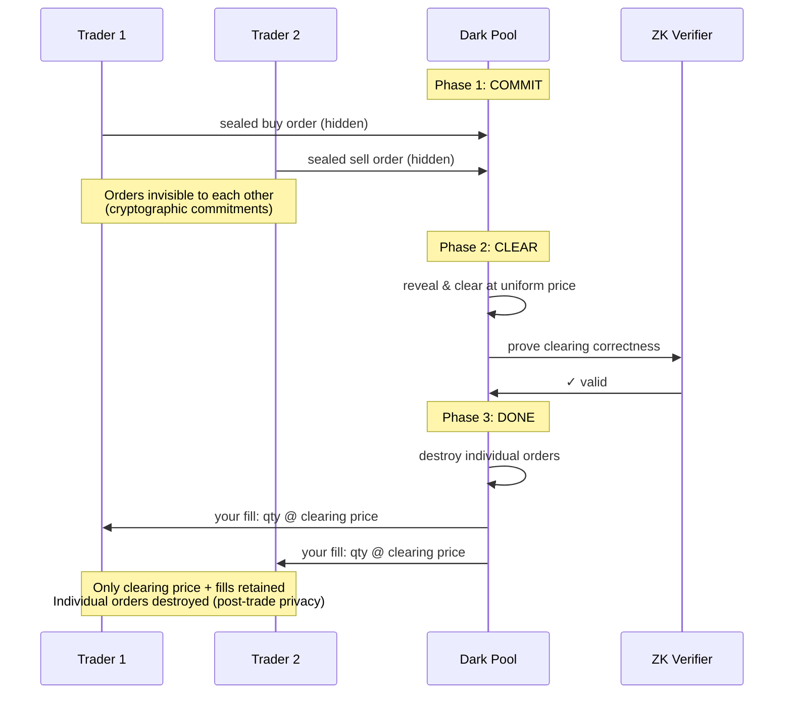

# ZKDarkPool

[spec](https://github.com/oxarbitrage/formal-market-mechanisms/blob/main/specs/ZKDarkPool.tla) · [config](https://github.com/oxarbitrage/formal-market-mechanisms/blob/main/specs/ZKDarkPool.cfg)

A sealed-bid batch auction with commit-reveal protocol — also known as a **hidden batch auction**, **encrypted batch auction**, or **sealed-bid batch auction**. This is not a different clearing mechanism from `BatchedAuction`: the clearing logic is identical (uniform price, maximum volume). The difference is an information-hiding layer: orders are sealed during collection and destroyed after clearing. All `BatchedAuction` invariants pass unchanged here, confirming they are structurally the same mechanism — privacy adds MEV resistance on top without altering correctness.

This models privacy-preserving DEXs like [Penumbra](https://penumbra.zone/) (sealed-bid batch auctions with shielded transactions on Cosmos), [Renegade](https://renegade.fi/) (MPC-based dark pool for on-chain private matching), and partially [MEV Blocker](https://mevblocker.io/) / [MEV Share](https://docs.flashbots.net/flashbots-mev-share/overview) (encrypted mempools).

Three phases enforce privacy structurally:
1. **Commit**: traders submit sealed orders — no visibility of others' orders (modeled as nondeterministic choice independent of other orders)
2. **Clear**: orders revealed, uniform-price batch clearing (same algorithm as `BatchedAuction`)
3. **Done**: individual orders destroyed, only clearing price + fills retained (ZK proofs verify correctness)

- **Pre-trade privacy**: order contents hidden during commit phase
- **Commitment binding**: orders cannot be modified after commit
- **Post-trade privacy**: individual orders destroyed after clearing
- **MEV elimination**: sealed bids + uniform price = zero spread to exploit = sandwich attacks impossible

## Verified properties

| Property | Type | Description |
|---|---|---|
| UniformClearingPrice | Invariant | All trades execute at the same clearing price |
| PriceImprovement | Invariant | Trade price within both parties' limits |
| PositiveTradeQuantities | Invariant | Every trade has quantity > 0 |
| NoSelfTrades | Invariant | No trade has the same buyer and seller |
| OrderingIndependence | Invariant | Clearing result is the same regardless of commit order |
| NoSpreadArbitrage | Invariant | Zero spread within the batch — no price difference to exploit |
| SandwichResistant | Invariant | Trader with both buy and sell fills gets the same price on both sides (zero profit from sandwich pattern) |
| PostTradeOrdersDestroyed | Invariant | After clearing, individual orders are destroyed (only clearing price + fills retained) |
| EventualClearing | Liveness | If the batch is ready to clear, it eventually clears |
